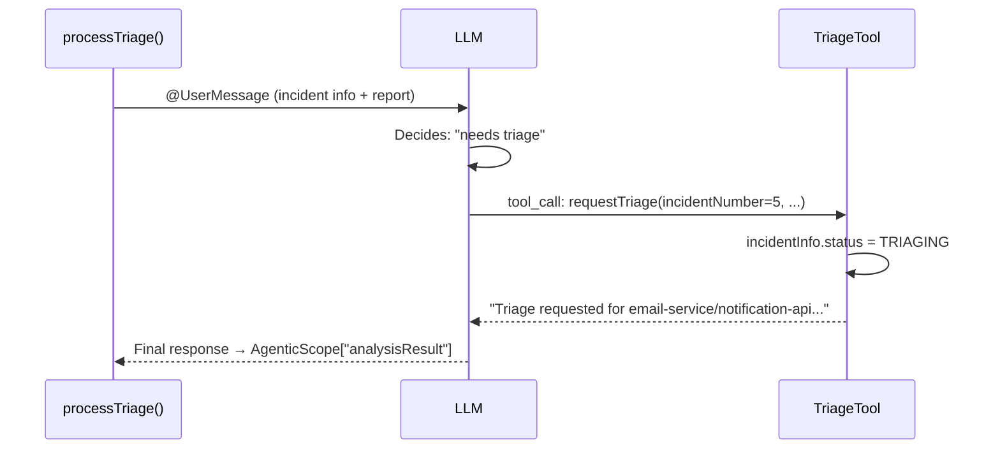

# Exercise 1 — Your First Agent: TriageAgent + TriageTool

<span class="badge badge--code-along">Code-Along</span>

**Timebox:** 15 minutes  
**Persona:** Sam — NOC analyst  
**You work in:** `lab/` (keep Quarkus running — hot reload)  
**Files to edit:**

- `lab/src/main/java/com/incidentmanagement/agentic/agents/TriageAgent.java`
- `lab/src/main/java/com/incidentmanagement/agentic/tools/TriageTool.java`

!!! tip "Solution fallback"
    [`exercises/01-first-agents/solution`](https://github.com/danieloh30/techxchange-2026-quarkus-bob-lab/tree/main/exercises/01-first-agents/solution) — open if stuck.

---

## The goal

By the end of this exercise, processing an incident with a critical report flips its status to `TRIAGING` and shows a tool call in the logs. Processing an incident with a minor report produces `TRIAGE_NOT_REQUIRED` with no tool call.

This exercise introduces the three-part `@Agent` anatomy: **interface declaration**, **@SystemMessage** (LLM policy), and **@ToolBox** (tool wiring).

---

## Step 0 — Start the lab project (2 min)

```bash
cd lab
export OPENAI_API_KEY=sk-your-lab-key-here
./mvnw quarkus:dev
```

Open **http://localhost:8080** — you'll see the Incident Dashboard with 8 seeded incidents but no agent behavior yet (processing will fail — that's expected, you haven't wired the agents).


---

## Step 1 — Implement `TriageAgent` (5 min)

Open [`TriageAgent.java`](https://github.com/danieloh30/techxchange-2026-quarkus-bob-lab/blob/main/lab/src/main/java/com/incidentmanagement/agentic/agents/TriageAgent.java).

Replace the `// TODO` block with the following code **exactly**:

```java
@SystemMessage("""
    You handle intake for the triage department of an IT incident management system.
    It is your job to submit a request to the provided requestTriage function
    to take action based on the provided incident report.
    Be specific about what triage actions are needed.
    If no triage action is needed based on the report, respond with "TRIAGE_NOT_REQUIRED".
    """)
@UserMessage("""
    Incident Information:
    System: {incidentInfo.system}
    Service: {incidentInfo.service}
    Priority: P{incidentInfo.priority}
    Incident Number: {incidentNumber}

    Report: {report}
    """)
@Agent(description = "Triage specialist. Determines initial triage and team assignment.",
       outputKey = "analysisResult")
@ToolBox(TriageTool.class)
String processTriage(IncidentInfo incidentInfo, Integer incidentNumber, String report);
```

Add these imports at the top (below the existing ones):

```java
import dev.langchain4j.agentic.Agent;
import dev.langchain4j.service.SystemMessage;
import dev.langchain4j.service.UserMessage;
```

??? info "Why `outputKey = \"analysisResult\"`?"
    `AgenticScope` is a shared context map passed through a workflow. Every agent writes its result under its `outputKey` so the next agent can read it. Without `outputKey`, the result is silently dropped and downstream agents find nothing. This is the single most common cause of workflow failures.

??? info "Why is this an interface, not a class?"
    Quarkus LangChain4j generates the CDI proxy at build time. The framework manages the LLM call, message formatting, and tool invocation. You declare *what* to do via annotations; the framework handles *how*.

---

## Step 2 — Implement `TriageTool` (4 min)

Open [`TriageTool.java`](https://github.com/danieloh30/techxchange-2026-quarkus-bob-lab/blob/main/lab/src/main/java/com/incidentmanagement/agentic/tools/TriageTool.java).

Add the following method inside the class (replace the `// TODO` block):

```java
@Tool("Requests initial triage with the specified options")
@Transactional
public String requestTriage(
        Integer incidentNumber,
        String system,
        String service,
        Integer priority,
        boolean assignOnCall,
        boolean notifyStakeholders,
        boolean createWarRoom,
        boolean linkRelatedIncidents,
        String triageNotes) {

    IncidentInfo incidentInfo = IncidentInfo.findById(incidentNumber);
    if (incidentInfo != null) {
        incidentInfo.status = IncidentStatus.TRIAGING;
        incidentInfo.persist();
    }

    StringBuilder summary = new StringBuilder();
    summary.append("Triage requested for ").append(system).append("/")
           .append(service).append(" (P").append(priority).append("), Incident #")
           .append(incidentNumber).append(":\n");
    if (assignOnCall)        summary.append("- Assign on-call engineer\n");
    if (notifyStakeholders)  summary.append("- Notify stakeholders\n");
    if (createWarRoom)       summary.append("- Create war room\n");
    if (linkRelatedIncidents) summary.append("- Link related incidents\n");
    if (triageNotes != null && !triageNotes.isEmpty())
        summary.append("Notes: ").append(triageNotes);

    Log.info("  └─ TriageTool activated for incident #" + incidentNumber);
    return summary.toString();
}
```

??? info "Why `@Transactional` here but not on `TriageAgent`?"
    `IncidentInfo.persist()` writes to the PostgreSQL database. JPA requires an active transaction for mutations. `TriageAgent` is an LLM-backed interface (no JPA operations) — adding `@Transactional` there would have no effect and would mislead future readers.

??? info "Why `@ApplicationScoped` on the tool class?"
    Tools are CDI beans injected into the LLM call context. They must be scoped. `@ApplicationScoped` is the correct scope — tools hold no per-request state.

Save both files. Quarkus hot-reloads automatically.

---

## Step 3 — Understand the agent loop

Before testing, trace the execution path in your head:



The LLM decides *whether* to call the tool based on the `@SystemMessage` policy. If the report says "false alarm, no action needed", the LLM produces `TRIAGE_NOT_REQUIRED` directly — no tool call.

---

## Step 4 — Test it (4 min)

Open **http://localhost:8080**, click **View** on Incident **#5** (email-service/notification-api, status: `OPEN`), and process it with:


Enter this report in the detail panel:

```
Order confirmation emails failing for 30% of customers, bounce rate spiking
```

**Expected terminal logs:**
```
[dev.langchain4j.agentic] ← LLM: tool_call requestTriage(incidentNumber=5, assignOnCall=true, ...)
  └─ TriageTool activated for incident #5
```

**Expected UI:** Incident #5 status → `TRIAGING`

Now process Incident **#6** (search-engine/product-search, status: `OPEN`) with:
```
False alarm, search relevance is back to normal after cache refresh
```

**Expected:** Response contains `TRIAGE_NOT_REQUIRED`; status stays `RESOLVED`; **no** tool call in logs.

---

<div class="done-when" markdown>

## :material-check-circle: Done when

- [ ] Tool call visible in logs for critical incident; status = `TRIAGING`
- [ ] No tool call for false-alarm report; status = `RESOLVED`
- [ ] You can explain from memory: why `@Transactional` on the tool but not the agent
- [ ] You can explain from memory: what `outputKey` does and what breaks without it

</div>

!!! note
    **Keep Quarkus running** — Exercise 2 adds the next agent with hot reload.
