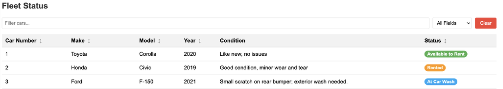

# Exercise 1 — Your First AI Agents

**Timebox:** 10 minutes  
**Story:** Maya (rental desk) needs automatic cleaning decisions from free-text return notes.  
**Solution project:** [`exercises/01-first-agents/solution`](https://github.com/danieloh30/techxchange-2026-quarkus-bob-lab/tree/main/exercises/01-first-agents/solution)  
**Upstream:** [section-2/step-01](https://quarkus.io/quarkus-workshop-langchain4j/section-2/step-01/)



## Start

```bash
cd exercises/01-first-agents/solution
./mvnw quarkus:dev
```

Open http://localhost:8080

## Do

1. Locate `CleaningAgent` and `CleaningTool`.
2. Return a car with: `Car has dog hair all over the back seat` → expect `AT_CLEANING`.
3. Return another with: `Car looks good` → expect `AVAILABLE` / `CLEANING_NOT_REQUIRED`.
4. (Optional) Tighten the `@SystemMessage` to be “picky” and retest.

## Done when

- [ ] You saw a tool call in logs for dirty cars
- [ ] You saw no tool call for clean cars
- [ ] You can explain agent vs chatbot in one sentence
