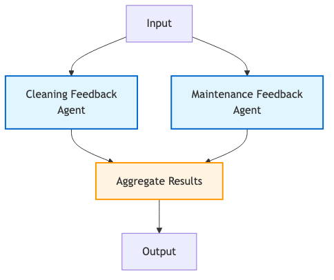

# Exercise 2 — Workflow Patterns

**Timebox:** 10 minutes  
**Persona:** Chris — Ops lead  
**Story:** Cleaning and maintenance analysis must happen concurrently. A car with an engine warning can't sit in the cleaning queue — it goes to maintenance.  
**Solution projects:**
- Sequence: [`exercises/02-workflow-patterns/solution-sequence`](https://github.com/danieloh30/techxchange-2026-quarkus-bob-lab/tree/main/exercises/02-workflow-patterns/solution-sequence) ← [upstream step-02](https://quarkus.io/quarkus-workshop-langchain4j/section-2/step-02/)
- Composed (parallel + conditional): [`exercises/02-workflow-patterns/solution-composed`](https://github.com/danieloh30/techxchange-2026-quarkus-bob-lab/tree/main/exercises/02-workflow-patterns/solution-composed) ← [upstream step-03](https://quarkus.io/quarkus-workshop-langchain4j/section-2/step-03/)



---

## Start (use composed for the full pattern set)

```bash
cd exercises/02-workflow-patterns/solution-composed
./mvnw quarkus:dev
```

> Compare with `solution-sequence` first if you want the simpler prompt-chaining baseline.

---

## Pattern map

| Need | Annotation | When to use | This exercise |
|------|-----------|-------------|--------------|
| A then B | `@SequenceAgent` | B needs output of A | Analyze feedback → update condition |
| A and B at once | `@ParallelMapperAgent` | Independent work, cut wall-clock | Cleaning + maintenance analysis concurrently |
| If X then A else B | `@ConditionalAgent` | Data-driven routing | Mechanical? → MaintenanceAgent; else CleaningAgent |
| Retry until good | `@LoopAgent` | Refine until quality threshold | Rewrite summary until it names severity |

---

## `AgenticScope` — the glue between agents

`AgenticScope` is a **request-scoped key-value store** injected into every agent and workflow. The `outputKey` attribute on `@Agent` / `@SequenceAgent` / `@ParallelMapperAgent` names the write slot. The next agent in the chain reads from the same scope.

```
FeedbackAnalysisWorkflow
  @ParallelMapperAgent(outputKey="feedbackAnalysisResults")
         │ writes feedbackAnalysisResults list
         ▼
FleetSupervisorAgent
  @SupervisorAgent — reads feedbackAnalysisResults from scope
         │ writes supervisorDecision
         ▼
CarConditionFeedbackAgent
  reads supervisorDecision → produces CarConditions
```

> **Rule you must know:** Any agent used inside `@SequenceAgent` or `@SupervisorAgent` **must** have `@Agent(outputKey = "...")`. Omitting `outputKey` causes a runtime scope resolution failure — the next agent finds nothing in the store.

---

## The parallel diagram

```
FeedbackTask[CLEANING]    ─┐
FeedbackTask[MAINTENANCE] ─┼──► FeedbackAnalysisAgent × 3  (run concurrently)
FeedbackTask[DISPOSITION] ─┘
                                │
                                ▼
                    FeedbackAnalysisResults
                 ┌──────────┬────────────┬────────────────┐
                 │cleaning  │maintenance │disposition     │
                 └──────────┴────────────┴────────────────┘
                                │
                     FleetSupervisorAgent (reads all three keys)
```

The `@ParallelMapperAgent` invokes the same `FeedbackAnalysisAgent` once per `FeedbackTask` in the input list — concurrently. Wall-clock time ≈ slowest single call rather than sum of all calls.

---

## Do

1. Open `CarProcessingWorkflow.java` — trace the `@SequenceAgent` sub-agent order.
2. Open `FeedbackAnalysisWorkflow.java` — find the `@ParallelMapperAgent` and `@Output` method.
3. Look at `FeedbackAnalysisAgent` — note `outputKey = "analysisResult"` on its `@Agent`.
4. Return Car **#5** (Ford Focus, RENTED) with:

```text
Engine warning light is on and the cabin smells like smoke
```

**Expected in logs:**
- Three `FeedbackAnalysisAgent` calls with overlapping timestamps (parallel)
- Routing leans toward maintenance over cleaning

### Stretch — LoopAgent mental model (~2 min if time)

A `@LoopAgent` runs the same agent repeatedly until an exit condition is met (or a max iteration limit is hit). For this project, a natural use would be `RefineConditionSummary` that loops until the output contains:
- Vehicle make/model/year
- A severity word (`minor` / `moderate` / `severe`)

Max 3 iterations. The composed solution focuses on parallel + conditional; the loop is in upstream step-03 — locate it if time permits.

---

## Done when

- [ ] Parallel path runs cleaning + maintenance analysis concurrently
- [ ] Routing sends mechanical issues toward maintenance
- [ ] You can explain `outputKey` and why omitting it breaks the workflow
- [ ] You can name all four patterns without notes
