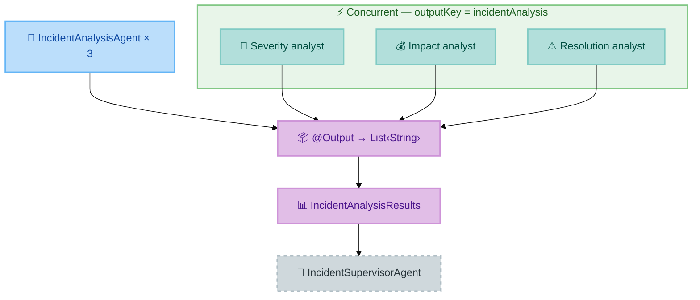

# Exercise 3 — Parallel Workflow: @ParallelMapperAgent

<span class="badge badge--code-along">Code-Along</span>

**Timebox:** 10 minutes  
**Persona:** Chris — Ops lead  
**You work in:** `lab/` (keep Quarkus running)  
**Files to edit:**

- `lab/src/main/java/com/incidentmanagement/agentic/agents/IncidentAnalysisAgent.java`
- `lab/src/main/java/com/incidentmanagement/agentic/workflow/IncidentAnalysisWorkflow.java`

!!! tip "Solution fallback"
    [`exercises/03-supervisor/solution`](https://github.com/danieloh30/techxchange-2026-quarkus-bob-lab/tree/main/exercises/03-supervisor/solution) — open if stuck.

---

## The goal

Instead of calling severity, impact, and resolution analysis sequentially, run all three **concurrently** with `@ParallelMapperAgent`. Wall-clock time ≈ slowest single call (not the sum). Then assemble three independent `String` results into a single typed `IncidentAnalysisResults` record via an `@Output` method.

This introduces two new concepts: **dynamic `@SystemMessage`** (same interface, different prompt at runtime) and **`@Output`** (result aggregation before the next agent reads scope).

---

## How `AgenticScope` connects agents



Each parallel invocation of `IncidentAnalysisAgent` writes its result under `"incidentAnalysis"`. The `@ParallelMapperAgent` framework collects these into a `List<String>` and passes it to the `@Output` method, which maps them positionally into `IncidentAnalysisResults`.

!!! warning "Rule"
    Every agent in a workflow **must** declare `outputKey`. Without it, the result is silently dropped from scope and the next agent finds nothing.

---

## Step 1 — Implement `IncidentAnalysisAgent` (4 min)

Open [`IncidentAnalysisAgent.java`](https://github.com/danieloh30/techxchange-2026-quarkus-bob-lab/blob/main/lab/src/main/java/com/incidentmanagement/agentic/agents/IncidentAnalysisAgent.java).

Replace the `// TODO` block with the following code **exactly**:

```java
@SystemMessage("{task.systemInstructions}")
@UserMessage("""
    Incident Information:
    System: {incidentInfo.system}
    Service: {incidentInfo.service}
    Priority: P{incidentInfo.priority}
    Current Description: {incidentInfo.description}

    Report: {report}
    """)
@Agent(description = "Incident analyzer. Using report, determines if action is needed based on task type.",
       outputKey = "incidentAnalysis")
String analyzeIncident(AnalysisTask task, IncidentInfo incidentInfo,
                       Integer incidentNumber, String report);
```

Add these imports:

```java
import dev.langchain4j.agentic.Agent;
import dev.langchain4j.service.SystemMessage;
import dev.langchain4j.service.UserMessage;
```

??? info "Dynamic `@SystemMessage` — one interface, three roles"
    The `{task.systemInstructions}` placeholder is resolved from the `AnalysisTask` parameter at runtime, not from a compile-time constant. The same interface handles three completely different analysis tasks:

    | Task index | `systemInstructions` content |
    |------------|------------------------------|
    | 0 | "You are a severity analyzer. Classify as P1-P4 or SEVERITY_LOW." |
    | 1 | "You are a business impact analyzer. Assess revenue/SLA impact or IMPACT_MINIMAL." |
    | 2 | "You are a resolution analyzer. If critical, ESCALATION_REQUIRED. Else ESCALATION_NOT_REQUIRED." |

    One interface declaration powers three concurrent LLM calls with different roles.

---

## Step 2 — Implement `IncidentAnalysisWorkflow` (3 min)

Open [`IncidentAnalysisWorkflow.java`](https://github.com/danieloh30/techxchange-2026-quarkus-bob-lab/blob/main/lab/src/main/java/com/incidentmanagement/agentic/workflow/IncidentAnalysisWorkflow.java).

Replace both `// TODO` blocks with the following **two members**:

**2a — `@ParallelMapperAgent` method:**

```java
@ParallelMapperAgent(
        description = "Analyzes incident reports in parallel for severity, impact, and resolution needs",
        outputKey = "incidentAnalysisResults",
        subAgent = IncidentAnalysisAgent.class,
        itemsProvider = "tasks")
IncidentAnalysisResults analyzeIncident(List<AnalysisTask> tasks,
                                        IncidentInfo incidentInfo,
                                        Integer incidentNumber,
                                        String report);
```

**2b — `@Output` static method:**

```java
@Output
static IncidentAnalysisResults output(AgenticScope scope,
                                      List<String> incidentAnalysisResults) {
    return new IncidentAnalysisResults(
            incidentAnalysisResults.get(0),  // severityAnalysis
            incidentAnalysisResults.get(1),  // impactAnalysis
            incidentAnalysisResults.get(2)   // resolutionAnalysis
    );
}
```

Add these imports at the top of the file:

```java
import dev.langchain4j.agentic.declarative.Output;
import dev.langchain4j.agentic.declarative.ParallelMapperAgent;
```

??? info "Why `itemsProvider = \"tasks\"`?"
    `@ParallelMapperAgent` needs to know which method parameter holds the list of items to fan out over. `itemsProvider = "tasks"` names the `tasks` parameter — the framework fans out one `IncidentAnalysisAgent` call per element in `tasks`. The three calls run concurrently in separate virtual threads.

??? info "Why a static `@Output` method?"
    `@Output` is a post-processing step, not an LLM call. It receives the collected results from all parallel invocations and transforms them into a typed record. It runs synchronously after all parallel calls complete. Marking it `static` makes it clear it is a pure transformation with no injected dependencies.

Save both files. Quarkus hot-reloads.

---

## Step 3 — Verify parallel execution (2 min)

Process Incident **#5** (email-service/notification-api) with:

```
Complete email delivery failure, SMTP connections timing out, queue backlog growing
```

**Watch the terminal logs.** You should see three `analyzeIncident` invocations with **overlapping timestamps** — they start within milliseconds of each other, not sequentially.

You can also open the **Dev UI** (`http://localhost:8080/q/dev`) → **CDI beans** panel and verify `IncidentAnalysisAgent` and `IncidentAnalysisWorkflow` appear as managed beans.

??? question "Why not a Java `for` loop instead of `itemsProvider`?"
    `AgenticScope` must be injected per-invocation so each parallel run gets its own scope context, result slot, and `outputKey` entry. A Java loop over LLM calls would run sequentially in the same thread with a shared scope — defeating both the parallelism and the scope isolation.

---

<div class="done-when" markdown>

## :material-check-circle: Done when

- [ ] `IncidentAnalysisAgent` and `IncidentAnalysisWorkflow` compile and appear in Dev UI CDI beans
- [ ] Terminal logs show overlapping timestamps for the three `analyzeIncident` invocations
- [ ] You can explain `outputKey` and `@Output` from memory
- [ ] You can explain how `@SystemMessage("{task.systemInstructions}")` enables one interface for 3 tasks

</div>
