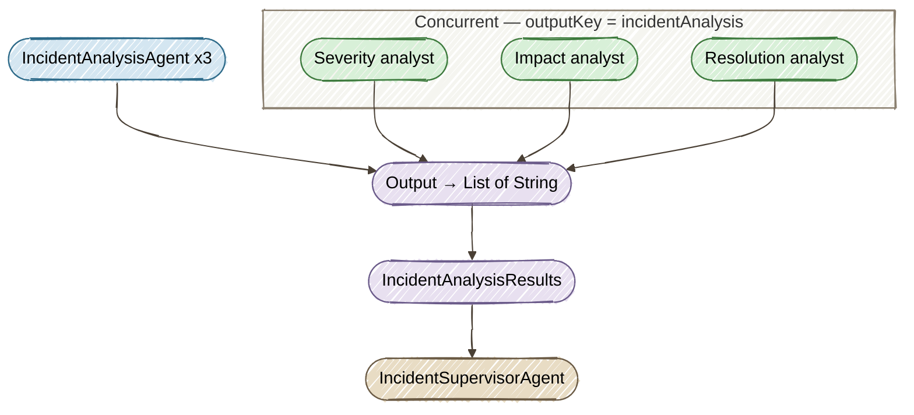

# Exercise 3 — Parallel Agents: @ParallelMapperAgent

<span class="badge badge--code-along">Code-Along</span>

**Timebox:** 10 minutes  
**Persona:** Chris — Ops lead  
**You work in:** `lab/` (keep Quarkus running)  
**Files to edit:**

- `lab/src/main/java/com/incidentmanagement/agentic/agents/IncidentAnalysisAgent.java`
- `lab/src/main/java/com/incidentmanagement/agentic/workflow/IncidentAnalysisWorkflow.java`

!!! tip "Solution fallback"
    [`solutions/03-parallel-workflow`](https://github.com/danieloh30/techxchange-2026-quarkus-bob-lab/tree/main/solutions/03-parallel-workflow){:target="_blank"} — open if stuck.

---

## The goal

Run three **parallel agents** — severity, impact, and resolution analysis — concurrently instead of sequentially. Wall-clock time ≈ slowest single call (not the sum). One interface declaration, three concurrent LLM calls, each with a different `@SystemMessage` injected at runtime.

This introduces two concepts: **dynamic `@SystemMessage`** (same agent interface, different prompt per task) and **`@Output`** (aggregating parallel results into a typed record before downstream agents read scope).

---

## How `AgenticScope` connects agents



Each parallel invocation of `IncidentAnalysisAgent` writes its result under `"incidentAnalysis"`. The `@ParallelMapperAgent` framework collects these into a `List<String>` and passes it to the `@Output` method, which maps them positionally into `IncidentAnalysisResults`.

!!! warning "Rule"
    Every agent in a workflow **must** declare `outputKey`. Without it, the result is silently dropped from scope and the next agent finds nothing.

---

## Step 1 — Implement `IncidentAnalysisAgent` (4 min)

Open [`IncidentAnalysisAgent.java`](https://github.com/danieloh30/techxchange-2026-quarkus-bob-lab/blob/main/lab/src/main/java/com/incidentmanagement/agentic/agents/IncidentAnalysisAgent.java){:target="_blank"}.

The method signature is already declared. Add these annotations **above** it:

```java
@SystemMessage("{task.systemInstructions}")
@UserMessage("""
    Incident Information:
    System: {incidentInfo.system}
    Service: {incidentInfo.service}
    Priority: P{incidentInfo.priority}
    Current Description: {incidentInfo.description}

    Report: {report}
    """)
@Agent(description = "Incident analyzer. Using report, determines if action is needed based on task type.",
       outputKey = "incidentAnalysis")
```

??? info "Dynamic `@SystemMessage` — one interface, three roles"
    The `{task.systemInstructions}` placeholder is resolved from the `AnalysisTask` parameter at runtime, not from a compile-time constant. The same interface handles three completely different analysis tasks:

    | Task index | `systemInstructions` content |
    |------------|------------------------------|
    | 0 | "You are a severity analyzer. Classify as P1-P4 or SEVERITY_LOW." |
    | 1 | "You are a business impact analyzer. Assess revenue/SLA impact or IMPACT_MINIMAL." |
    | 2 | "You are a resolution analyzer. If critical, ESCALATION_REQUIRED. Else ESCALATION_NOT_REQUIRED." |

    One interface declaration powers three concurrent LLM calls with different roles.

---

## Step 2 — Implement `IncidentAnalysisWorkflow` (3 min)

Open [`IncidentAnalysisWorkflow.java`](https://github.com/danieloh30/techxchange-2026-quarkus-bob-lab/blob/main/lab/src/main/java/com/incidentmanagement/agentic/workflow/IncidentAnalysisWorkflow.java){:target="_blank"}.

Replace both `// TODO` blocks with the following **two members**:

**2a — `@ParallelMapperAgent` method:**

```java
@ParallelMapperAgent(
        description = "Analyzes incident reports in parallel for severity, impact, and resolution needs",
        outputKey = "incidentAnalysisResults",
        subAgent = IncidentAnalysisAgent.class,
        itemsProvider = "tasks")
IncidentAnalysisResults analyzeIncident(List<AnalysisTask> tasks,
                                        IncidentInfo incidentInfo,
                                        Integer incidentNumber,
                                        String report);
```

**2b — `@Output` static method:**

```java
@Output
static IncidentAnalysisResults output(AgenticScope scope,
                                      List<String> incidentAnalysisResults) {
    return new IncidentAnalysisResults(
            incidentAnalysisResults.get(0),  // severityAnalysis
            incidentAnalysisResults.get(1),  // impactAnalysis
            incidentAnalysisResults.get(2)   // resolutionAnalysis
    );
}
```

??? info "Why `itemsProvider = \"tasks\"`?"
    `@ParallelMapperAgent` needs to know which method parameter holds the list of items to fan out over. `itemsProvider = "tasks"` names the `tasks` parameter — the framework fans out one `IncidentAnalysisAgent` call per element in `tasks`. The three calls run concurrently in separate virtual threads.

??? info "Why a static `@Output` method?"
    `@Output` is a post-processing step, not an LLM call. It receives the collected results from all parallel invocations and transforms them into a typed record. It runs synchronously after all parallel calls complete. Marking it `static` makes it clear it is a pure transformation with no injected dependencies.

Save both files. Quarkus hot-reloads.

---

## Step 3 — Verify in the Dev UI (1 min)

Open the [Agentic Dev UI](http://localhost:8080/q/dev-ui/quarkus-langchain4j-agentic/agents){:target="_blank"} to see the agent graph. Look for these two entries:

| Agent | Type | Key detail |
|-------|------|------------|
| IncidentAnalysisWorkflow | ParallelMapperAgent | subAgent = IncidentAnalysisAgent, itemsProvider = "tasks" |
| IncidentAnalysisAgent | Agent | outputKey = "incidentAnalysis" |

This page visualizes every agent's type, `outputKey`, and sub-agent wiring — use it after every exercise to confirm your changes compiled and registered correctly.

??? question "Why not a Java `for` loop instead of `itemsProvider`?"
    `AgenticScope` must be injected per-invocation so each parallel run gets its own scope context, result slot, and `outputKey` entry. A Java loop over LLM calls would run sequentially in the same thread with a shared scope — defeating both the parallelism and the scope isolation.

---

## Step 4 — Test parallel execution (2 min)

The full workflow isn't wired in `lab/` yet (that happens in Exercise 4), so you'll run this test from the **solution project**.

Stop `lab/` first (`Ctrl+C`), then start the solution:

```bash
cd ../solutions/03-parallel-workflow
./mvnw quarkus:dev
```

Open the [topology](http://localhost:8080/q/dev-ui/quarkus-langchain4j-agentic/topology){:target="_blank"} — this solution has `IncidentProcessingWorkflow` fully wired, so the full agent tree is visible.

Open **[http://localhost:8080](http://localhost:8080){:target="_blank"}**, click **View** on Incident **#5** (email-service/notification-api), and process with:

```
SMTP timeout for 30% of outbound emails, queue growing
```

**How to confirm:** Watch the Quarkus terminal logs. You should see three parallel analysis calls with **overlapping timestamps** — this is the key proof that `@ParallelMapperAgent` runs concurrently, not sequentially:

```
ResolutionAgent updating...
```

Check the UI — incident status should change (e.g., `TRIAGING` or `IN_PROGRESS` depending on the analysis results).

Now process Incident **#6** (search-engine/product-search) with:

```
False alarm, relevance restored after cache refresh
```

**How to confirm:** Check the UI — incident status stays `OPEN` (action = `MONITOR`). The parallel analysis determined this is a low-severity, low-impact false alarm.

!!! tip "Parallelism proof"
    Wall-clock time for 3 parallel analyses ≈ time for 1 call. If they ran sequentially, processing would take ~3x longer. Compare the timestamp of the first log line to `ResolutionAgent updating...` — you'll see the total time is close to a single LLM call, not the sum of three.

Stop the solution (`Ctrl+C`) and restart `lab/`:

```bash
cd ../../lab
./mvnw quarkus:dev
```

---

<div class="done-when" markdown>

## :material-check-circle: Done when

- [ ] `IncidentAnalysisAgent` and `IncidentAnalysisWorkflow` appear in the [Agentic Dev UI](http://localhost:8080/q/dev-ui/quarkus-langchain4j-agentic/agents){:target="_blank"}
- [ ] No compile errors in the Quarkus terminal after hot reload
- [ ] Parallel execution tested via solution — overlapping timestamps in logs
- [ ] You can explain `outputKey` and `@Output` from memory
- [ ] You can explain how dynamic SystemMessage enables one interface for 3 tasks

</div>
