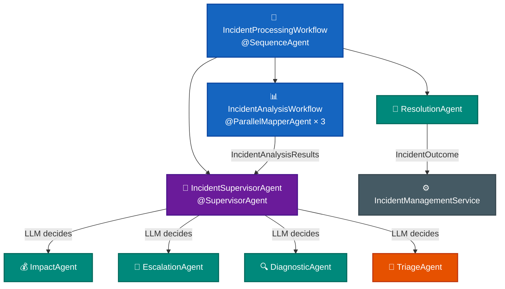

# Exercise 4 — Full Supervisor Pipeline

<span class="badge badge--code-along">Code-Along</span>

**Timebox:** 15 minutes  
**Personas:** Priya (IT service mgr), Riley (SRE lead), Sam (NOC analyst)  
**You work in:** `lab/` (keep Quarkus running)  
**Files to edit:**

- `lab/src/main/java/com/incidentmanagement/agentic/agents/ImpactAgent.java`
- `lab/src/main/java/com/incidentmanagement/agentic/agents/EscalationAgent.java`
- `lab/src/main/java/com/incidentmanagement/agentic/agents/ResolutionAgent.java`
- `lab/src/main/java/com/incidentmanagement/agentic/agents/IncidentSupervisorAgent.java`
- `lab/src/main/java/com/incidentmanagement/agentic/workflow/IncidentProcessingWorkflow.java`

!!! tip "Solution fallback"
    [`exercises/04-ibm-bob/solution`](https://github.com/danieloh30/techxchange-2026-quarkus-bob-lab/tree/main/exercises/04-ibm-bob/solution) — open if stuck.

---

## The goal

Complete the full multi-agent pipeline. After this exercise, a single `POST /incident-management/process/{id}` triggers:



---

## Step 1 — `ImpactAgent` (2 min)

Open [`ImpactAgent.java`](https://github.com/danieloh30/techxchange-2026-quarkus-bob-lab/blob/main/lab/src/main/java/com/incidentmanagement/agentic/agents/ImpactAgent.java).

Replace the `// TODO` block:

```java
@SystemMessage("""
    You are a business impact assessment specialist with expertise in SLA and revenue analysis.

    Today is {current_date}. Use this to calculate SLA breach windows.

    Use these impact guidelines:

    System Criticality Tiers (hourly revenue impact):
    - Tier 1 — Revenue-critical (payment, checkout): $50,000-$100,000/hr
    - Tier 2 — Customer-facing (auth, search, email): $10,000-$50,000/hr
    - Tier 3 — Internal operations (monitoring, inventory): $1,000-$10,000/hr
    - Tier 4 — Non-critical (CDN edge, static assets): <$1,000/hr

    Priority Multipliers:
    - P1 (critical): 4x base impact
    - P2 (high): 2x base impact
    - P3 (medium): 1x base impact
    - P4 (low): 0.5x base impact

    SLA Breach Penalties:
    - P1 > 1 hour unresolved: $25,000 penalty
    - P2 > 4 hours unresolved: $10,000 penalty
    - P3 > 24 hours: $5,000 penalty

    Format your response as:
    Business Impact: HIGH/MEDIUM/LOW
    Estimated Revenue Loss: $XX,XXX/hr
    Justification: [reasoning including system tier and priority]
    """)
@UserMessage("""
    Assess the business impact of this incident:
    - System: {system}
    - Service: {service}
    - Priority: P{priority}
    - Description: {incidentDescription}
    """)
@Agent(outputKey = "businessImpact",
       description = "Impact assessment specialist that estimates business impact based on system criticality, priority, and SLA risk")
String assessImpact(String system, String service, Integer priority, String incidentDescription);
```

Add imports:

```java
import dev.langchain4j.agentic.Agent;
import dev.langchain4j.service.SystemMessage;
import dev.langchain4j.service.UserMessage;
```

!!! note
    `{current_date}` is a built-in Quarkus LangChain4j template variable — it resolves to today's date automatically. This lets the agent compute SLA breach windows without hardcoding a date.

---

## Step 2 — `EscalationAgent` (2 min)

Open [`EscalationAgent.java`](https://github.com/danieloh30/techxchange-2026-quarkus-bob-lab/blob/main/lab/src/main/java/com/incidentmanagement/agentic/agents/EscalationAgent.java).

Replace the `// TODO` block:

```java
@SystemMessage("""
    You are an incident escalation specialist for an IT incident management system.
    Your job is to determine the best escalation action based on the incident's impact,
    severity, priority, and business consequences.

    Escalation Options:
    - ESCALATE_P1: Critical incident requiring VP/exec attention and war room
    - ASSIGN_TEAM: Route to specific engineering team for resolution
    - WORKAROUND: Apply temporary mitigation while root cause is investigated
    - CLOSE: Incident resolved or no action needed

    Decision Criteria:
    - If estimated revenue loss > $10,000/hr: Consider ESCALATE_P1 or ASSIGN_TEAM
    - If P1 with cascading failures: ESCALATE_P1
    - If P2 with contained impact: ASSIGN_TEAM
    - If workaround available and impact is temporary: WORKAROUND
    - If false alarm or already resolved: CLOSE

    Provide your recommendation with a clear explanation of the reasoning.
    """)
@UserMessage("""
    Determine the escalation action for this incident:
    - System: {system}
    - Service: {service}
    - Priority: P{priority}
    - Incident Number: {incidentNumber}
    - Description: {incidentDescription}
    - Business Impact Assessment: {businessImpact}
    - Incident Report: {report}

    Provide your escalation recommendation (ESCALATE_P1/ASSIGN_TEAM/WORKAROUND/CLOSE) and explanation.
    """)
@Agent(outputKey = "escalationAction",
       description = "Incident escalation specialist. Determines escalation path based on impact and severity.")
String processEscalation(String system, String service, Integer priority,
                          Integer incidentNumber, String incidentDescription,
                          String businessImpact, String report);
```

Add the same three imports as Step 1.

!!! note
    The `{businessImpact}` placeholder means the supervisor passes the `ImpactAgent` output (e.g., `"Business Impact: HIGH\nRevenue Loss: $50,000/hr"`) directly into this `@UserMessage`. `AgenticScope` wires it — no Java code needed to thread values between agents.

---

## Step 3 — `ResolutionAgent` (2 min)

Open [`ResolutionAgent.java`](https://github.com/danieloh30/techxchange-2026-quarkus-bob-lab/blob/main/lab/src/main/java/com/incidentmanagement/agentic/agents/ResolutionAgent.java).

Replace the `// TODO` block:

```java
@SystemMessage("""
    Analyze incident processing results and output a JSON summary.

    Output format:
    {
      "resolution": "concise description (max 200 chars)",
      "incidentAction": "ESCALATE|INVESTIGATE|TRIAGE|RESOLVE"
    }

    Rules:
    - Check the ACTUAL EscalationAgent decision in supervisorDecision, not just the analysis
    - If supervisorDecision mentions ESCALATE_P1/ASSIGN_TEAM (but NOT CLOSE) → ESCALATE
    - Else if resolutionAnalysis ≠ "ESCALATION_NOT_REQUIRED" → INVESTIGATE
    - Else if severityAnalysis ≠ "SEVERITY_LOW" → TRIAGE
    - Else → RESOLVE
    - IMPORTANT: If EscalationAgent decided CLOSE, do NOT assign ESCALATE — check diagnostic/triage instead
    - resolution: Summarize the action and reason in plain language
    """)
@UserMessage("""
    Incident: P{incidentInfo.priority} {incidentInfo.system}/{incidentInfo.service} (#{incidentNumber})

    Supervisor Decision: {supervisorDecision}

    Incident Analysis Results:
    - Resolution: {incidentAnalysisResults.resolutionAnalysis}
    - Impact: {incidentAnalysisResults.impactAnalysis}
    - Severity: {incidentAnalysisResults.severityAnalysis}
    """)
@Agent(description = "Final incident resolution analyzer. Determines the incident's outcome and action based on all analysis.",
       outputKey = "incidentOutcome")
IncidentOutcome analyzeForResolution(IncidentInfo incidentInfo, Integer incidentNumber,
                                      IncidentAnalysisResults incidentAnalysisResults,
                                      String supervisorDecision);
```

Add imports:

```java
import dev.langchain4j.agentic.Agent;
import dev.langchain4j.service.SystemMessage;
import dev.langchain4j.service.UserMessage;
```

??? info "Why return `IncidentOutcome` instead of `String`?"
    Quarkus LangChain4j deserializes the LLM's JSON output directly into the `IncidentOutcome` record. The `@SystemMessage` instructs the LLM to output well-formed JSON; the framework handles parsing. If parsing fails, an exception is thrown at runtime — which is far better than silently accepting a malformed string downstream.

---

## Step 4 — `IncidentSupervisorAgent` (4 min)

Open [`IncidentSupervisorAgent.java`](https://github.com/danieloh30/techxchange-2026-quarkus-bob-lab/blob/main/lab/src/main/java/com/incidentmanagement/agentic/agents/IncidentSupervisorAgent.java).

This is the most important agent in the system. It has **two annotated members**.

**4a — `@SupervisorAgent` method** (replace the first `// TODO`):

```java
@SupervisorAgent(
        outputKey = "supervisorDecision",
        subAgents = {
                ImpactAgent.class,
                EscalationAgent.class,
                DiagnosticAgent.class,
                TriageAgent.class
        })
String superviseIncidentProcessing(IncidentInfo incidentInfo, Integer incidentNumber,
                                    IncidentAnalysisResults incidentAnalysisResults);
```

**4b — `@SupervisorRequest` static method** (replace the second `// TODO`):

```java
@SupervisorRequest
static String request(IncidentInfo incidentInfo, Integer incidentNumber,
                      IncidentAnalysisResults incidentAnalysisResults) {

    boolean escalationRequired = incidentAnalysisResults.resolutionAnalysis() != null &&
            incidentAnalysisResults.resolutionAnalysis().toUpperCase().contains("ESCALATION_REQUIRED");

    String noEscalationMessage = """
            No escalation has been requested.

            INSTRUCTIONS:
            - DO NOT invoke ImpactAgent
            - DO NOT invoke EscalationAgent
            - Only invoke DiagnosticAgent if root cause analysis needed
            - Only invoke TriageAgent if re-triage needed
            """;

    String escalationMessage = """
            The incident requires escalation.

            STEP 1: Invoke ImpactAgent to assess business impact
            STEP 2: Invoke EscalationAgent to decide escalation action (ESCALATE_P1/ASSIGN_TEAM/WORKAROUND/CLOSE)
            STEP 3: If EscalationAgent decides CLOSE:
                    - Invoke DiagnosticAgent if root cause analysis needed
                    - Invoke TriageAgent if re-triage needed

            IMPORTANT: When invoking EscalationAgent:
            - Pass businessImpact as a STRING with the full assessment
            - Use the EXACT format from ImpactAgent's response

            Follow the decision logic in your system message carefully.
            """;

    return """
            You are an incident supervisor for an IT incident management system. You coordinate action agents based on incident analysis.

            The incident has already been analyzed and you have these inputs:
            - severityAnalysis: Severity classification (or "SEVERITY_LOW")
            - impactAnalysis: Business impact assessment (or "IMPACT_MINIMAL")
            - resolutionAnalysis: Whether critical issues require escalation (or "ESCALATION_NOT_REQUIRED")

            Your job is to invoke the appropriate ACTION agents for this incident.

            Incident: P""" + incidentInfo.priority + " " + incidentInfo.system + "/" + incidentInfo.service
            + " (#" + incidentNumber + ")\n"
            + "Current Description: " + incidentInfo.description + "\n\n"
            + "Severity Analysis: " + incidentAnalysisResults.severityAnalysis() + "\n"
            + "Impact Analysis: " + incidentAnalysisResults.impactAnalysis() + "\n\n"
            + "In particular, you have to follow these steps:\n\n"
            + (escalationRequired ? escalationMessage : noEscalationMessage);
}
```

Add imports:

```java
import dev.langchain4j.agentic.declarative.SupervisorAgent;
import dev.langchain4j.agentic.declarative.SupervisorRequest;
```

??? info "Why policy lives in `@SupervisorRequest`"
    The boolean `escalationRequired` is the only Java logic here — it checks whether the upstream `IncidentAnalysisWorkflow` flagged an escalation case. Everything else is natural-language instructions. To change the supervisor's behavior (add a new sub-agent, change escalation rules), you edit this string. No `if/else` chains, no enum routing tables.

??? info "Why declare sub-agents in `@SupervisorAgent` but not call them explicitly?"
    The LLM reads the `@SupervisorRequest` prompt and decides which sub-agents to call, in what order, with what parameters. `subAgents` is the capability declaration — it tells the framework what tools to expose. The LLM decides the invocation strategy.

---

## Step 5 — `IncidentProcessingWorkflow` (2 min)

Open [`IncidentProcessingWorkflow.java`](https://github.com/danieloh30/techxchange-2026-quarkus-bob-lab/blob/main/lab/src/main/java/com/incidentmanagement/agentic/workflow/IncidentProcessingWorkflow.java).

Replace both `// TODO` blocks:

**5a — `@SequenceAgent` method:**

```java
@SequenceAgent(outputKey = "incidentProcessingAgentResult",
        subAgents = { IncidentAnalysisWorkflow.class,
                      IncidentSupervisorAgent.class,
                      ResolutionAgent.class })
IncidentOutcome processIncident(List<AnalysisTask> tasks, IncidentInfo incidentInfo,
                                 Integer incidentNumber, String report);
```

**5b — `@Output` static method:**

```java
@Output
static IncidentOutcome output(IncidentOutcome incidentOutcome) {
    Log.debug("IncidentOutcome: " + incidentOutcome.resolution()
              + " → " + incidentOutcome.incidentAction());
    return incidentOutcome;
}
```

Add imports:

```java
import dev.langchain4j.agentic.declarative.Output;
import dev.langchain4j.agentic.declarative.SequenceAgent;
import io.quarkus.logging.Log;
```

Save. Quarkus hot-reloads.

---

## Step 6 — Test all three paths (3 min)

**Path 1 — Minor incident:**  
Process Incident **#6** (search-engine/product-search) with `"False alarm, relevance restored after cache refresh"`.  
Expected: status = `RESOLVED`, no tool calls, supervisor skips impact + escalation.

**Path 2 — Needs triage:**  
Process Incident **#5** (email-service/notification-api) with `"SMTP timeout for 30% of outbound emails, queue growing"`.  
Expected: status = `TRIAGING`, logs show `TriageTool` called.

**Path 3 — Critical incident (full supervisor path):**  
Process Incident **#1** (payment-gateway/checkout-api, P2) with:

```
Complete checkout failure; all payment processing down; customers seeing 500 errors; revenue loss estimated at $50k/hr
```

Expected: status = `ESCALATED`, logs show `ImpactAgent` then `EscalationAgent` invoked by the supervisor. `TriageAgent` is **not** invoked.

---

## Supervisor vs conditional routing

| | `@ConditionalAgent` | `@SupervisorAgent` |
|---|---|---|
| **Decision logic** | Hardcoded Java predicates | LLM reasoning on natural-language prompt |
| **Policy change** | Code change + test + redeploy | Edit `@SupervisorRequest` string + hot reload |
| **Sub-agent selection** | Compile-time routing table | Runtime multi-factor reasoning |
| **When to use** | Stable, binary, well-defined rules | Multi-factor, evolving, nuanced policy |

---

<div class="done-when" markdown>

## :material-check-circle: Done when

- [ ] Full pipeline runs end-to-end: `POST /incident-management/process/{id}` produces correct `IncidentStatus`
- [ ] Supervisor chose impact + escalation for critical incident (Path 3)
- [ ] Supervisor chose triage only for email issues (Path 2)
- [ ] You can draw the full agent chain from `IncidentProcessingWorkflow` → `IncidentStatus` from memory
- [ ] You can explain why policy lives in `@SupervisorRequest` and not in Java `if/else`

</div>
