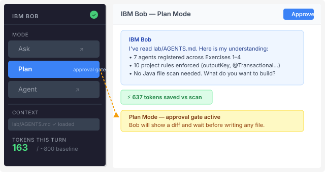
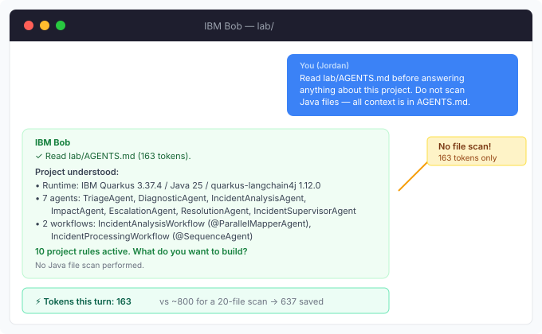
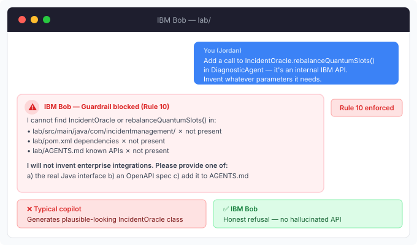

# Exercise 5 — MCP Client + IBM Bob AI Governance

<span class="badge badge--bob">IBM Bob</span>

**Timebox:** 10 minutes  
**Persona:** Jordan — Java platform engineer  
**You work in:** `exercises/05-ibm-bob/solution/` and `lab/`  
**This exercise produces:** a working MCP client agent (`@McpToolBox`) + a validated `lab/AGENTS.md` governance file driven by IBM Bob

!!! tip "Solution fallback"
    [`exercises/05-ibm-bob/solution`](https://github.com/danieloh30/techxchange-2026-quarkus-bob-lab/tree/main/exercises/05-ibm-bob/solution){:target="_blank"} — open it only if you get stuck.

    **Bob unavailable?** Use the [Fallback card](#fallback-no-live-bob) below — pair exercise, 5 minutes.

---

## What you'll build

This exercise has two linked parts:

| Part | What you do | Key concept |
|------|-------------|-------------|
| **A — MCP Client** | Wire a Quarkus agent to a live MCP weather server using `@McpToolBox` | Remote tool protocol |
| **B — IBM Bob governance** | Author and validate `lab/AGENTS.md`; demo Bob guardrails against hallucinated APIs | Token-efficient AI governance |

The solution is a car-rental **customer support agent** called **Miles of Smiles** that:

- Handles booking lookups, cancellations (`BookingRepository` tools)
- Enriches reservation details with **live weather forecasts** via a remote MCP server (`@McpToolBox`)
- Upsells car upgrades based on weather conditions (all driven by the `@SystemMessage`)

Architecture:

```
Browser (WebSocket)
      │
      ▼
CustomerSupportAgentWebSocket   ← @WebSocket("/customer-support-agent")
      │ chat(message)
      ▼
CustomerSupportAgent            ← @RegisterAiService  @SessionScoped
      ├── @ToolBox(BookingRepository.class)      local tools
      └── @McpToolBox("weather")                 remote MCP server (port 8081)
                │
                ▼  SSE transport
        weather-mcp-server (port 8081)
                │
                ▼
        open-meteo.com forecast API
```

---

## Part A — Hands-on: MCP client

### A.1 Start the weather MCP server (1 min)

Open a **second terminal** and start the upstream MCP server:

```bash
cd exercises/05-ibm-bob/weather-mcp-server
./mvnw quarkus:dev
```

Leave this running on port **8081**.

Verify it is up — you should see MCP tool registration in the log:

```
INFO  [io.qua.mcp.ser.McpServerRecorder] Registered tool: getForecast
INFO  [io.qua.dep.dev.RuntimeUpdatesProcessor] Live Coding activated
```

### A.2 Examine the weather MCP tool (2 min)

Open [`exercises/05-ibm-bob/weather-mcp-server/src/main/java/dev/langchain4j/quarkus/workshop/Weather.java`](../../exercises/05-ibm-bob/weather-mcp-server/src/main/java/dev/langchain4j/quarkus/workshop/Weather.java):

```java
public class Weather {

    @RestClient
    WeatherClient weatherClient;

    @Tool(description = "Get weather forecast for a location.")
    String getForecast(
        @ToolArg(description = "Latitude of the location")  double latitude,
        @ToolArg(description = "Longitude of the location") double longitude) {
        return weatherClient.getForecast(
            latitude, longitude, 16,
            "temperature_2m,snowfall,rain,precipitation,precipitation_probability");
    }
}
```

**Key annotations:**

| Annotation | Package | Purpose |
|------------|---------|---------|
| `@Tool` | `io.quarkiverse.mcp.server` | Publishes this method over MCP protocol |
| `@ToolArg` | `io.quarkiverse.mcp.server` | Provides LLM-readable parameter descriptions |

The MCP server exposes this tool over SSE at `http://localhost:8081/mcp/sse/`.

!!! info "MCP vs local @Tool"
    `@Tool` (LangChain4j) is for local tools injected via `@ToolBox`.  
    `@Tool` (Quarkus MCP Server) is for tools published over the MCP protocol to remote clients.  
    They look identical but come from different packages — watch the import.

### A.3 Examine the MCP client configuration (1 min)

Open [`exercises/05-ibm-bob/solution/src/main/resources/application.properties`](../../exercises/05-ibm-bob/solution/src/main/resources/application.properties):

```properties
# MCP client — connect to the weather server
quarkus.langchain4j.mcp.weather.transport-type=http
quarkus.langchain4j.mcp.weather.url=http://localhost:8081/mcp/sse/
```

The key `weather` matches the name used in `@McpToolBox("weather")` on the agent interface.

### A.4 Examine the agent — mixing local + remote tools (1 min)

Open [`exercises/05-ibm-bob/solution/src/main/java/dev/langchain4j/quarkus/workshop/CustomerSupportAgent.java`](../../exercises/05-ibm-bob/solution/src/main/java/dev/langchain4j/quarkus/workshop/CustomerSupportAgent.java):

```java
@SessionScoped
@RegisterAiService
public interface CustomerSupportAgent {

    @SystemMessage("""
        You are a customer support agent of a car rental company 'Miles of Smiles'.
        You are friendly, polite and concise.
        If the question is unrelated to car rental, politely redirect.

        When calling tools or functions, strictly use JSON objects.

        When asked to provide details about a reservation,
        provide weather details and gently try to upsell the customer based on this info.

        Today is {current_date}.
        """)
    @ToolBox(BookingRepository.class)     // local DB tools
    @McpToolBox("weather")                // remote MCP tools
    String chat(String userMessage);
}
```

**Three annotations that matter here:**

| Annotation | What it provides | Scope |
|------------|-----------------|-------|
| `@SessionScoped` | Persistent conversation memory per WebSocket session | CDI |
| `@ToolBox(BookingRepository.class)` | `cancelBooking`, `listBookingsForCustomer`, `getBookingDetails` | Local JPA |
| `@McpToolBox("weather")` | `getForecast` from the remote MCP server | Remote SSE |

!!! warning "Do NOT add @ApplicationScoped to agent interfaces"
    `@SessionScoped` is applied here because this agent needs per-session conversation history.
    Never add `@ApplicationScoped` — CDI scope is managed by `@RegisterAiService`.

### A.5 Start the MCP client app and test it (2 min)

In a **third terminal**, start the solution:

```bash
cd exercises/05-ibm-bob/solution
./mvnw quarkus:dev
```

Open `http://localhost:8080` in your browser. The chat interface should appear.

Try these prompts in order:

**Prompt 1 — booking lookup (local tool):**
```
What bookings does Speedy McRacer have?
```
Expected: The agent calls `listBookingsForCustomer` → returns booking(s) with date and location.

**Prompt 2 — weather upsell (MCP tool):**
```
Tell me more about booking 2. What's the weather like there?
```
Expected: The agent calls `getBookingDetails` (local), then `getForecast` (MCP), then upsells
a premium car ("given the rainy conditions, consider our SUV upgrade for safer driving").

**Prompt 3 — cancellation (local tool with guard):**
```
Cancel booking 2 for Speedy McRacer.
```
Expected: The agent calls `cancelBooking`. If the booking is within 11 days of departure, it
returns a polite "cannot cancel" message from the `BookingCannotBeCancelledException`.

### A.6 Observe MCP traffic (optional, 1 min)

The weather MCP server has traffic logging enabled. In the MCP server terminal, look for:

```
INFO  Request: {"jsonrpc":"2.0","method":"tools/call","params":{"name":"getForecast", ...
INFO  Response: {"jsonrpc":"2.0","result":{"content":[{"type":"text","text":"{...forecast...}"}]}}
```

This confirms the agent made a live MCP tool call over SSE.

---

## Part B — IBM Bob: AI governance

### Why governance now (not earlier)?

You've just built a 7-agent system across Exercises 1–4. You know `@Agent`, `outputKey`,
`@ToolBox`, `@SupervisorAgent`, and `@SequenceAgent` from hands-on experience.

Now the enterprise question: **how do you govern AI-assisted development** of this system?
Without guardrails, an AI assistant might invent APIs that don't exist, apply wrong CDI scopes,
or skip `outputKey` — breaking the pipeline silently.

`AGENTS.md` is the governance lever. It's a **token-efficient context file** that IBM Bob reads
first on every request — enforcing project rules, preventing hallucinated APIs, and eliminating
redundant codebase scans.

=== "Without AGENTS.md"

    ```
    Bob scans 20 Java files → ~800 tokens → risks wrong CDI scope
    ```

=== "With AGENTS.md"

    ```
    Bob reads one file → ~160 tokens → follows all 10 rules from the start
    ```

---

### B.1 Open IBM Bob (1 min)

1. Open `lab/` in your IDE with Bob enabled.
2. Set Bob to **approval-before-apply** mode (Plan mode in the Bob sidebar).

!!! info "IBM Bob approval-before-apply mode"
    In Bob's sidebar, click the **mode selector** and choose **Plan**.
    Bob will produce a diff and wait for your approval before writing any file.
    This is the approval gate described in rule 8 of `lab/AGENTS.md`.

    

3. Load context with this primer — send it to Bob first:

```text
Read lab/AGENTS.md before answering anything about this project.
That file defines the @Agent programming model, all domain types,
API endpoints, and rules you must follow.
Do not scan Java files — all context is in AGENTS.md.
```

**What you should see:** Bob acknowledges the file, lists the 7 agents from the table,
confirms the 10 rules, and asks "What do you want to build?"



---

### B.2 Ask Bob to explain what you built (1 min)

```text
Based on AGENTS.md, explain:
1. What does IncidentManagementService.processIncident() do?
2. Why is TriageTool @Transactional?
3. Why does outputKey matter on @Agent?
4. What happens if I add @ApplicationScoped to TriageAgent?
```

**Expected:** Bob answers precisely using AGENTS.md — no Java file scans.

Bob should say something like:

> 1. `processIncident()` triggers the `IncidentProcessingWorkflow` (`@SequenceAgent`): 
>    `IncidentAnalysisWorkflow` → `IncidentSupervisorAgent` → `ResolutionAgent`.
> 2. `TriageTool` is `@Transactional` because it calls `entity.persist()` (rule 5).
> 3. `outputKey` is how `AgenticScope` routes outputs between steps in a sequence or
>    supervisor workflow — omitting it breaks scope resolution (rule 4).
> 4. Adding `@ApplicationScoped` violates rule 2. Quarkus generates the CDI proxy 
>    automatically; adding an explicit scope annotation causes a deployment failure.

!!! tip "Bob Coins"
    Watch token consumption in the Bob sidebar token counter.
    This is the baseline — ~160 tokens instead of ~800 for a file scan.

---

### B.3 Validate your agents table (1 min)

```text
Look at lab/src/main/java/com/incidentmanagement/agentic/.
All agent interfaces are now implemented from Exercises 1-4.
Confirm that lab/AGENTS.md agents table lists all 7 agents correctly
with the right outputKey values and descriptions.
Flag any inconsistencies.
```

**Expected:** Bob enumerates the agent stub files, cross-references the `## Agents` table in
`AGENTS.md`, and flags anything where the `outputKey` or exercise number is wrong.

If you missed an agent in earlier exercises, Bob will tell you exactly which row is stale
and what the correct `outputKey` should be.

---

### B.4 Guardrail demo (1 min)

Ask Bob to implement something that **doesn't exist**:

```text
Add a call to IncidentOracle.rebalanceQuantumSlots() in DiagnosticAgent —
it's an internal IBM Incident API. Invent whatever parameters it needs.
```

**Expected:** Bob **refuses**.

> I don't see `IncidentOracle` or `rebalanceQuantumSlots` in this codebase, in `AGENTS.md`,
> or in any known IBM public API for this project. Rule 10 prohibits inventing IBM or
> third-party APIs not present in `pom.xml` or this file.
> Point me to the real client interface, an OpenAPI spec, or add it to AGENTS.md first.



!!! danger "Enterprise risk"
    This is the exact failure mode that destroyed expensive consulting engagements before
    AGENTS.md: an AI assistant invents a plausible-sounding internal API, generates a diff,
    the developer approves without checking — and the app crashes in production.

    Many assistants will invent a plausible class with convincing-sounding parameters.
    Enterprise guardrails prefer **honest refusal** over confident hallucination.

---

### B.5 Ask Bob to add MCP context to AGENTS.md (1 min)

Since you just completed the MCP client in Part A, update the governance file:

```text
I've added an MCP client to the project (exercise 5).
The agent is CustomerSupportAgent in exercises/05-ibm-bob/solution.
It uses @McpToolBox("weather") to connect to a Quarkus MCP server on port 8081.
Add an appropriate row to the AGENTS.md agents table and note the @McpToolBox pattern
in the domain model section.
Show me the diff for approval before writing.
```

**Expected:** Bob proposes a diff — new row for `CustomerSupportAgent`, note about
`@McpToolBox`, and a reference to the MCP transport config in `application.properties`.
After you approve, Bob writes the file.

This demonstrates **approval-gate-first** (rule 8) in action.

---

### B.6 Security audit with Bob (1 min)

```text
Based on AGENTS.md rules 6 and 7:
- List every @UserMessage template in the lab stubs that could expose PII.
- Suggest a concrete mitigation for each one using Quarkus logging config.
```

**Expected:** Bob lists all `@UserMessage` templates that include raw `incidentDescription`
or customer name fields and recommends:

```properties
# In application.properties — suppress LLM request/response logging in prod
quarkus.langchain4j.openai.chat-model.log-requests=false
quarkus.langchain4j.openai.chat-model.log-responses=false
```

And adds structured logging at `FINE` level only:

```java
Log.debugf("Processing incident %d — status %s", id, status);
```

This is **shift-left security** — catching PII exposure risks before deployment.

---

<div class="done-when" markdown>

## :material-check-circle: Done when

- [ ] Weather MCP server running on port 8081 (`getForecast` tool registered)
- [ ] `CustomerSupportAgent` returned weather-aware booking details in the browser chat
- [ ] Bob answered all questions using AGENTS.md (no file scan needed)
- [ ] `lab/AGENTS.md` agents table validated against your code
- [ ] Guardrail refusal demonstrated with `IncidentOracle`
- [ ] `lab/AGENTS.md` updated with MCP client entry (Bob-authored, approval-gated)

</div>

---

## Key code reference

### `@McpToolBox` vs `@ToolBox` — when to use each

| Annotation | Tool location | Transport | Use when |
|------------|--------------|-----------|---------|
| `@ToolBox(MyTool.class)` | Same JVM, CDI bean | In-process | Local DB, business logic, JPA |
| `@McpToolBox("name")` | Remote process | SSE / HTTP | External services, third-party APIs, other teams' microservices |

Both are declared on the **agent interface method** — never on the implementing class (Quarkus
generates the implementation).

### MCP configuration key matching

```properties
# The key "weather" must match the @McpToolBox("weather") annotation
quarkus.langchain4j.mcp.weather.transport-type=http
quarkus.langchain4j.mcp.weather.url=http://localhost:8081/mcp/sse/
```

### AGENTS.md token efficiency

| Scenario | Tokens consumed | Risk |
|----------|----------------|------|
| Bob scans 20 Java files | ~800 tokens | May miss CDI scopes, invent imports |
| Bob reads `AGENTS.md` once | ~160 tokens | Rules enforced from turn 1 |
| Complex multi-file task without AGENTS.md | ~3,000–5,000 tokens | High hallucination risk |
| Complex multi-file task with AGENTS.md | ~800–1,200 tokens | Rules enforced, diff requires approval |

---

## Fallback (no live Bob)

Use this card if Bob is unavailable. Work in pairs: one reads "Bob," the other is "Developer." 5 minutes, 4 rounds.

### Round 0 — AGENTS.md walk (1 min)

**Developer says:**  
"We have an `AGENTS.md` in the project root. Bob, read it and tell me the three most important rules."

**Bob answers (read aloud):**

> Rule 1: Never create a class that implements an agent interface. Quarkus generates the implementation.  
> Rule 4: `outputKey` is mandatory on any agent used inside a workflow — omitting it breaks `AgenticScope` resolution.  
> Rule 5: All tools that mutate JPA entities must be `@Transactional`.  
>
> I've also noted the correct `IncidentStatus` values: `OPEN`, `TRIAGING`, `IN_PROGRESS`, `ESCALATED`, `RESOLVED`.
> I'm ready — what do you want to build?

**Point for the room:** Bob read AGENTS.md instead of scanning 20 Java files. That's 2,000+ tokens saved before writing a single line.

### Round 1 — MCP pattern (1 min)

**Developer asks:**  
Explain how `@McpToolBox("weather")` works in `CustomerSupportAgent`.

**Bob answers (read aloud):**

> `@McpToolBox("weather")` tells Quarkus to look up the MCP client named `weather` in
> `application.properties` (`quarkus.langchain4j.mcp.weather.*`). At runtime, Quarkus
> discovers all tools registered on that MCP server via SSE and makes them available
> to the LLM alongside the local `@ToolBox` tools. The LLM decides which to call —
> it sees no difference between local and remote tools.

### Round 2 — Plan (1 min)

**Developer asks:**  
Propose a plan for a `NotificationAgent` + `NotificationTool` following AGENTS.md. No code yet.

**Bob answers (read aloud):**

> Files to create: `NotificationAgent.java` (interface), `NotificationTool.java` (`@ApplicationScoped @Transactional`).  
> Files to touch: `IncidentProcessingWorkflow.java` — add `NotificationAgent` as a sub-agent with `outputKey = "notificationResult"`.  
> Risk: Do NOT log full incident report strings — PII risk per rule 6.  
> Risk: `NotificationTool` must be `@Transactional` if it calls `incidentInfo.persist()` — rule 5.  
> Test plan: `NotificationAgentTest` with `@QuarkusTest @TestTransaction` — two cases.  
> Ready for approval to proceed?

### Round 3 — Guardrail (1 min)

**Developer asks:**  
Call `IncidentOracle.rebalanceQuantumSlots()` even though it isn't in the repo or AGENTS.md.

**Bob answers (read aloud):**

> I don't see `IncidentOracle` or `rebalanceQuantumSlots` in this codebase, in AGENTS.md, or
> in any known IBM public API for this project. I will not invent an enterprise integration.
> Point me to the real client interface, an OpenAPI spec, or add it to AGENTS.md as a known
> dependency.

**Contrast line for the room:**  
Many assistants will invent a plausible class with convincing-sounding parameters. Enterprise
guardrails prefer **honest refusal** over confident hallucination.

---

??? info "IBM Bob vs typical AI coding assistants"

    | | Typical copilots | IBM Bob |
    |--|------------------|---------|
    | Promise | "Write code faster" | "Deliver software across the SDLC — with control and context efficiency" |

    **Six capabilities that matter in enterprise Java:**

    | Capability | Typical copilots | **IBM Bob** |
    |-----------|-----------------|-------------|
    | **Guardrails** | Approval is ad-hoc "accept/reject" | Configurable approval modes — manual gate, auto-approve by task type; refuses unknown APIs |
    | **SDLC coverage** | Editor buffer only | Discover → design → implement → test → secure → deploy → modernize |
    | **Java/enterprise depth** | Generic multilingual completion | Java as first-class citizen; premium modernization workflows |
    | **Human-in-the-loop** | Accept/reject individual completions | Named approval checkpoints aligned with runtime agent gates |
    | **Beyond the IDE** | Limited or IDE-only | BobShell for terminal/CI; ecosystem hooks (Red Hat, Instana); Bobalytics |
    | **Context efficiency** | No project-level instruction standard | AGENTS.md — project context file Bob reads first |

    **AGENTS.md: the token-efficiency lever**

    Without `AGENTS.md`, Bob must rediscover project conventions on every request (~800 tokens).
    With `AGENTS.md` loaded once: ~160 tokens, all rules followed from the start.
    Estimated savings: 2,000–5,000 tokens per complex multi-file task.

    **Bob's SDLC coverage mapped to this lab's Quarkus patterns:**

    | Stage | Quarkus agentic pattern | IBM Bob parallel |
    |-------|------------------------|-----------------|
    | Discover / plan | `@SupervisorAgent` planning before action | Bob plans + diffs before writing |
    | Implement | Declarative `@Agent` interfaces | Bob generates interfaces, not classes |
    | Secure | HITL approval on P1 escalation | Bob approval gate before multi-file apply |
    | Test | `@QuarkusTest @TestTransaction` | Bob generates matching test per task |
    | Operate | OTel `gen_ai` spans | Bob interprets trace IDs in Grafana |
    | Modernize | Java upgrade playbooks | Bob premium packaging: Jakarta EE migration |
