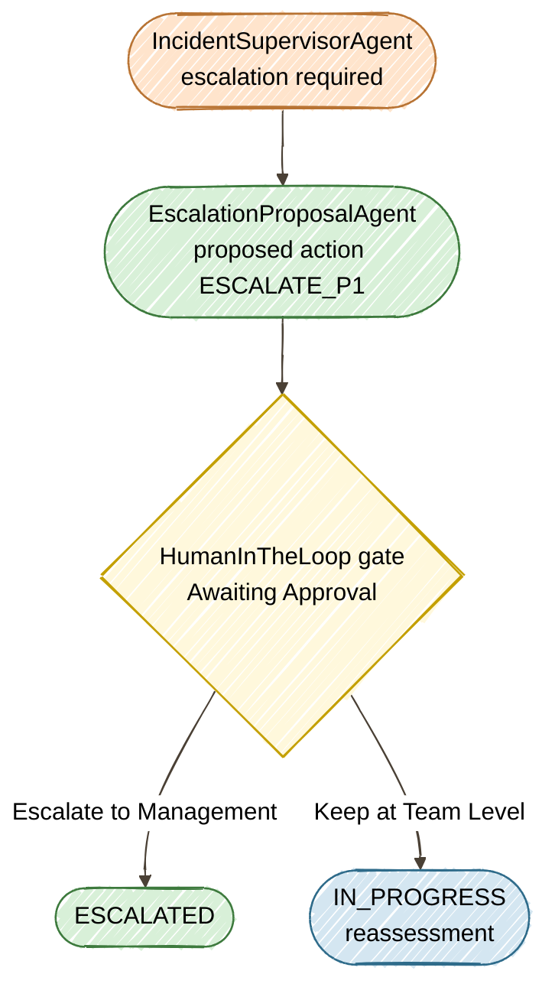

# Exercise 6 — Human Gate + Tracing

<span class="badge badge--code-along">Code-Along</span>

**Timebox:** 10 minutes  
**Persona:** Alex — Compliance officer  
**You work in:** `lab/` (keep Quarkus running)  
**Files to edit:**

- `lab/src/main/java/com/incidentmanagement/agentic/agents/EscalationProposalAgent.java`

!!! tip "Solution fallback"
    [`exercises/06-hitl-observability/solution`](https://github.com/danieloh30/techxchange-2026-quarkus-bob-lab/tree/main/exercises/06-hitl-observability/solution){:target="_blank"} — open if stuck.

---

## The goal

The compliance rule: **no autonomous escalation of P1/P2 incidents on revenue-critical systems**.  
Without a gate, the supervisor you built in Exercise 4 would ESCALATE a P1 payment-gateway outage based purely on LLM reasoning.  
With `@HumanInTheLoop`, the system proposes and pauses — a human approves or rejects. And with OpenTelemetry tracing, every LLM call, tool invocation, and approval decision is auditable.

This exercise introduces two concepts: **`EscalationProposalAgent`** (an LLM agent that creates escalation proposals) and **`@HumanInTheLoop`** (a gate that pauses the workflow until a human decides).



---

## Step 1 — Implement `EscalationProposalAgent` (3 min)

Open [`EscalationProposalAgent.java`](https://github.com/danieloh30/techxchange-2026-quarkus-bob-lab/blob/main/lab/src/main/java/com/incidentmanagement/agentic/agents/EscalationProposalAgent.java){:target="_blank"}.

Replace the `// TODO` block with the following code **exactly**:

```java
@SystemMessage("""
    You are an escalation proposal specialist for an IT incident management system.
    Your role is to evaluate whether a critical incident should be escalated to executive management.
    Consider: incident priority (P1/P2), affected system criticality, business impact assessment, and estimated revenue loss.

    Escalation Options:
    - ESCALATE_TO_VP: Incident has severe business impact on revenue-critical systems
    - ESCALATE_TO_CTO: Incident involves critical infrastructure failure or security breach
    - KEEP_AT_TEAM_LEVEL: Incident can be handled by the current team

    Decision Criteria:
    - If P1 on revenue-critical system with high revenue impact: ESCALATE_TO_VP
    - If incident involves security breach, data loss, or infrastructure failure: ESCALATE_TO_CTO
    - If P2 with moderate impact that team can handle: KEEP_AT_TEAM_LEVEL
    - If impact is contained and manageable: KEEP_AT_TEAM_LEVEL

    Your response must include:
    1. Proposed Action with unique marker: __ESCALATE_TO_VP__ or __ESCALATE_TO_CTO__ or __KEEP_AT_TEAM_LEVEL__
    2. Reasoning: Clear explanation of your recommendation

    Format your response as:
    Proposed Action: __[ESCALATE_TO_VP/ESCALATE_TO_CTO/KEEP_AT_TEAM_LEVEL]__
    Reasoning: [Your detailed explanation]

    CRITICAL: Use double underscores around the action (e.g., __ESCALATE_TO_VP__ not ESCALATE_TO_VP)
    """)
@UserMessage("""
    Create an escalation proposal for this incident:
    - System: {incidentSystem}
    - Service: {incidentService}
    - Priority: {incidentPriority}
    - Incident Number: {incidentNumber}
    - Current Description: {incidentDescription}
    - Estimated Revenue Impact: {businessImpact}
    - Incident Report: {feedback}

    Provide your escalation proposal with clear reasoning.
    """)
@Agent(outputKey = "escalationProposal", description = "Creates escalation proposals for critical incidents requiring management attention")
String createEscalationProposal(
        String incidentSystem,
        String incidentService,
        String incidentPriority,
        Integer incidentNumber,
        String incidentDescription,
        String businessImpact,
        String feedback);
```

Save the file. Quarkus hot-reloads. Check the terminal for any compile errors.

Open the [Agentic Dev UI](http://localhost:8080/q/dev-ui/quarkus-langchain4j-agentic/agents){:target="_blank"} — confirm `EscalationProposalAgent` appears with `outputKey = "escalationProposal"`.

??? info "Why a separate proposal agent?"
    `EscalationProposalAgent` creates a structured proposal — the **what** and **why** of the escalation. `HumanApprovalAgent` (pre-built in the solution) is the **gate** — it pauses the workflow, presents the proposal to a human via the UI, and blocks until they decide. Separating proposal from approval means you can change escalation criteria (edit `@SystemMessage`) without touching the approval infrastructure.

---

## Step 2 — Test the HITL gate (3 min)

The full HITL flow requires `HumanApprovalAgent` + approval service infrastructure, which is pre-built in the solution. Stop `lab/` first (`Ctrl+C`), then start the solution:

```bash
cd exercises/06-hitl-observability/solution
./mvnw quarkus:dev
```

!!! tip "Agentic Dev UI"
    Open the [topology](http://localhost:8080/q/dev-ui/quarkus-langchain4j-agentic/topology){:target="_blank"} — compare it to Exercise 4. The tree now includes `EscalationProposalAgent` and `HumanApprovalAgent` branching off the supervisor.

Open **http://localhost:8080**, click **View** on Incident **#1** (payment-gateway/checkout-api, P2), and process with:

```text
Complete checkout failure, all transactions failing, revenue loss confirmed at $50k/hr
```

**How to confirm:** The UI shows an **"Awaiting Approval"** modal with two buttons. This is the HITL gate — the system has paused and is waiting for a human decision.

- Click **Escalate to Management** → check that the UI status changes to `ESCALATED`
- Now press `s` in the Quarkus terminal to restart (reset the database). Process Incident **#1** again with the same report → this time click **Keep at Team Level** → check that the UI status changes to `IN_PROGRESS`

In the Quarkus terminal logs, look for the `HumanApprovalAgent` span showing the approval decision.


---

## Step 3 — Read OTel spans in Grafana (4 min)

Open **http://localhost:3000** → Explore → Tempo → service `incident-management`.


Find spans and read:

| Attribute | What to look for |
|-----------|-----------------|
| gen_ai.usage.input_tokens | How many tokens each LLM call consumed |
| gen_ai.usage.output_tokens | Generated tokens |
| langchain4j.tool.name | Which tool the LLM invoked |
| duration | End-to-end latency including all LLM round-trips |

!!! warning "Production caution"
    `include-prompt=true` exports full prompt text to your tracing backend. This can include PII from `@UserMessage` templates. Disable or redact before production.

**FinOps thought experiment:** 500 incidents/day × avg 1,500 input tokens × gpt-4o pricing = ~$15/day.  
An unbounded `@UserMessage` without AGENTS.md discipline can double input tokens → $30/day.  
Tracing is how you catch that before the bill arrives.

Stop the solution (`Ctrl+C`) and restart `lab/`:

```bash
cd ../../../lab
./mvnw quarkus:dev
```

---

<div class="done-when" markdown>

## :material-check-circle: Done when

- [ ] `EscalationProposalAgent` compiles in `lab/` — appears in the [Agentic Dev UI](http://localhost:8080/q/dev-ui/quarkus-langchain4j-agentic/agents){:target="_blank"}
- [ ] HITL gate blocked escalation on a critical incident (tested via solution)
- [ ] HITL gate allowed escalation after approval
- [ ] At least one `gen_ai.usage.input_tokens` span found in Grafana/Tempo
- [ ] You can explain `include-prompt=true` trade-off (compliance value vs PII risk)

</div>
