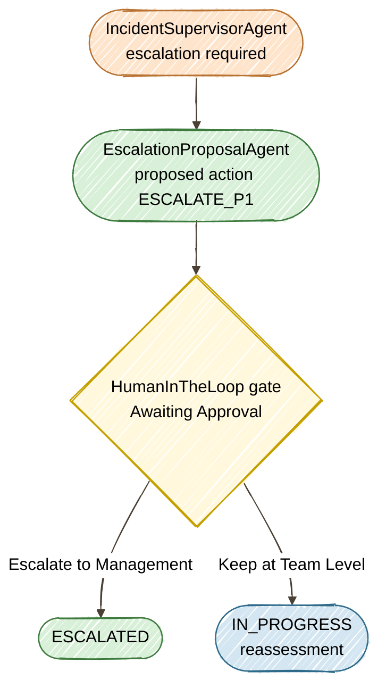

# Exercise 6 — Human Gate + Tracing

<span class="badge badge--run-read">Run + Read</span>

**Timebox:** 10 minutes  
**Persona:** Alex — Compliance officer  
**You work in:** `solutions/06-hitl-observability` (run + read)

!!! tip "Solution"
    [`solutions/06-hitl-observability`](https://github.com/danieloh30/techxchange-2026-quarkus-bob-lab/tree/main/solutions/06-hitl-observability){:target="_blank"}

---

## The goal

The compliance rule: **no autonomous escalation of P1/P2 incidents on revenue-critical systems**.  
Without a gate, the supervisor you built in Exercise 4 would ESCALATE a P1 payment-gateway outage based purely on LLM reasoning.  
With `@HumanInTheLoop`, the system proposes and pauses — a human approves or rejects. And with OpenTelemetry tracing, every LLM call, tool invocation, and approval decision is auditable.

This exercise introduces two concepts: **`EscalationProposalAgent`** (an LLM agent that creates escalation proposals) and **`@HumanInTheLoop`** (a gate that pauses the workflow until a human decides).

!!! info "Why run + read instead of code-along?"
    Quarkus validates all `@Agent` parameters at **build time** against the workflow's `AgenticScope` output keys. HITL agents depend on outputs from each other (`escalationProposal` → `approvalDecision`), so adding a stub to `lab/` without wiring the full chain causes `IllegalConfigurationException`. Plus, `HumanApprovalAgent` is infrastructure code (`CompletableFuture`, `ApprovalService`, timeout handling) — not a 3-minute paste. So you run the working solution and focus on **understanding the pattern** rather than fighting build errors.



---

## Step 1 — Start and read the HITL agents (3 min)

Stop your `lab/` Quarkus process first (`Ctrl+C`), then start the solution:

```bash
cd ../solutions/06-hitl-observability
./mvnw quarkus:dev
```

Wait for the LGTM stack:
```
DevServices for Observability started — Grafana: http://localhost:3000
incident-management started in ~4s
```

!!! note "First start may be slow"
    The LGTM container (Grafana + Loki + Tempo + Mimir) is pulled on first run and can take 1–2 minutes. If `http://localhost:3000` isn't reachable, wait for the `DevServices for Observability started` log line before proceeding. If it doesn't appear, restart dev mode (`Ctrl+C` then `./mvnw quarkus:dev`).

!!! tip "Agentic Dev UI"
    Open the [Agentic Dev UI](http://localhost:8080/q/dev-ui/quarkus-langchain4j-agentic/agents){:target="_blank"} to see the full agent graph. Notice `EscalationProposalAgent` and `HumanApprovalAgent` — the HITL gate shows up as a distinct agent type in the wiring view.

    Check the [topology](http://localhost:8080/q/dev-ui/quarkus-langchain4j-agentic/topology){:target="_blank"} — compare it to Exercise 4. The tree now includes the HITL agents.

Open [`EscalationProposalAgent.java`](https://github.com/danieloh30/techxchange-2026-quarkus-bob-lab/blob/main/solutions/06-hitl-observability/src/main/java/com/incidentmanagement/agentic/agents/EscalationProposalAgent.java){:target="_blank"} — this is the same `@Agent` pattern you've been coding, with a `@SystemMessage` that defines escalation criteria and a `@UserMessage` template.

Open [`HumanApprovalAgent.java`](https://github.com/danieloh30/techxchange-2026-quarkus-bob-lab/blob/main/solutions/06-hitl-observability/src/main/java/com/incidentmanagement/agentic/agents/HumanApprovalAgent.java){:target="_blank"} — this is the HITL gate. Key differences from a regular `@Agent`:

| Annotation | Purpose |
|-----------|---------|
| `@HumanInTheLoop` | Human gate — pauses the workflow here |
| `static` method | Not an LLM call — blocks until human input via `CompletableFuture` |

??? info "Why a separate proposal agent?"
    `EscalationProposalAgent` creates a structured proposal — the **what** and **why** of the escalation. `HumanApprovalAgent` is the **gate** — it pauses the workflow, presents the proposal to a human via the UI, and blocks until they decide. Separating proposal from approval means you can change escalation criteria (edit `@SystemMessage`) without touching the approval infrastructure.

---

## Step 2 — Test the HITL gate (3 min)

Open **[http://localhost:8080](http://localhost:8080){:target="_blank"}**, click **View** on Incident **#1** (payment-gateway/checkout-api, P2), and process with:

```text
Complete checkout failure, all transactions failing, revenue loss confirmed at $50k/hr
```

**How to confirm:** The UI shows an **"Awaiting Approval"** modal with two buttons. This is the HITL gate — the system has paused and is waiting for a human decision.

- Click **Escalate to Management** → check that the UI status changes to `ESCALATED`
- Now press `s` in the Quarkus terminal to restart (reset the database), then **reload the browser**. Process Incident **#1** again with the same report → this time click **Keep at Team Level** → check that the UI status changes to `IN_PROGRESS`

In the Quarkus terminal logs, look for `WORKFLOW PAUSED` and `WORKFLOW RESUMED` showing the approval decision.


---

## Step 3 — Read OTel spans in Grafana (4 min)

!!! note "Grafana not responding?"
    Pressing `s` restarts the app and resets the database, but the LGTM container (Grafana + Tempo) stays running — your Step 2 traces are preserved. If [http://localhost:3000](http://localhost:3000){:target="_blank"} is not responding, stop dev mode (`Ctrl+C`) and restart it — the LGTM container may need a fresh start on first use.

Open **[http://localhost:3000](http://localhost:3000){:target="_blank"}** and navigate to traces:

1. Click the **hamburger menu** (&#9776;) in the top-left → **Explore**
2. In the data source dropdown (top-left of the Explore panel), select **Tempo**
3. Switch the **Query type** tab from "TraceQL" to **Search**
4. In the **Service Name** dropdown, select **incident-management**
5. Click **Run query** (blue button, top-right) — you should see a list of traces

!!! tip "Service name not in the dropdown?"
    Tempo registers services only after traces arrive. If you completed Step 2, `incident-management` should already appear — just refresh the dropdown. If it still doesn't show, go back to [http://localhost:8080](http://localhost:8080){:target="_blank"}, process any incident (e.g., Incident **#5** with `SMTP timeout for 30% of outbound emails`), then refresh. Traces can take a few seconds to propagate.

Click any **Trace ID** link to expand the span waterfall. Look for the `POST /incident-management/process/{id}` trace — it contains the full agent workflow.


In the span waterfall, look for:

| Span | What it tells you |
|------|-------------------|
| `PlannerAgent.plan` | Orchestration step that plans the workflow |
| `EscalationProposalAgent` | Time spent generating the escalation proposal |
| `ResolutionAgent.analyze` | Final resolution analysis |
| `completion gpt-4o` | Individual LLM call inside each agent |
| `POST /chat/completions` | Raw HTTP request to the model API |

Click any span to expand its attributes — look for `gen_ai.usage.input_tokens`, `gen_ai.usage.output_tokens`, and total `duration` to understand cost and latency per agent.

!!! warning "Production caution"
    `include-prompt=true` exports full prompt text to your tracing backend. This can include PII from `@UserMessage` templates. Disable or redact before production.

**FinOps thought experiment:** 500 incidents/day × avg 1,500 input tokens × gpt-4o pricing = ~$15/day.  
An unbounded `@UserMessage` without AGENTS.md discipline can double input tokens → $30/day.  
Tracing is how you catch that before the bill arrives.

Stop the solution (`Ctrl+C`) and restart `lab/`:

```bash
cd ../../../lab
./mvnw quarkus:dev
```

---

<div class="done-when" markdown>

## :material-check-circle: Done when

- [ ] You can explain `@HumanInTheLoop` vs regular `@Agent` — what makes the workflow pause
- [ ] HITL gate paused and escalated after clicking **Escalate to Management** → status `ESCALATED`
- [ ] HITL gate paused and kept at team level after clicking **Keep at Team Level** → status `IN_PROGRESS`
- [ ] Grafana/Tempo shows the span waterfall with agent names (e.g., `EscalationProposalAgent`, `completion gpt-4o`) and durations
- [ ] You understand the FinOps trade-off: tracing reveals per-agent token cost, but `include-prompt=true` can leak PII

</div>

