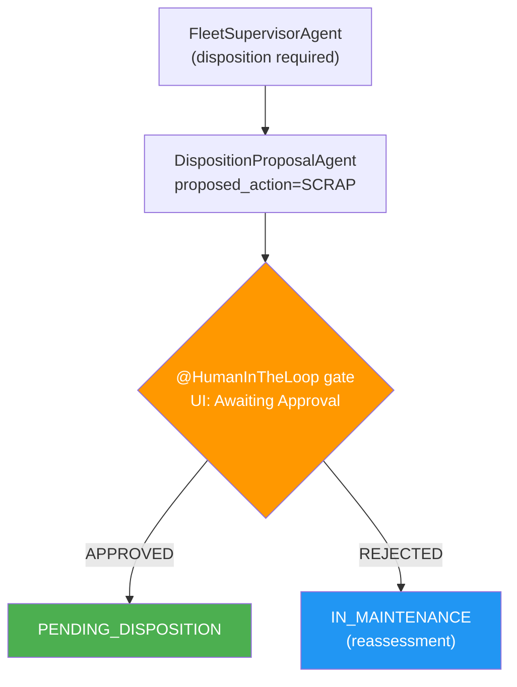

# Exercise 6 — Human-in-the-Loop + Observability

<span class="badge badge--run-read">Run + Read</span>

**Timebox:** 10 minutes  
**Persona:** Alex — Compliance officer  
**You work in:** `exercises/06-hitl-observability/solution` (run + read — HITL is pre-built)  
**Learn by:** reading `DispositionProposalAgent` + `HumanApprovalAgent`, running the UI, reading OTel spans

!!! tip "Reference solution"
    [`exercises/06-hitl-observability/solution`](https://github.com/danieloh30/techxchange-2026-quarkus-bob-lab/tree/main/exercises/06-hitl-observability/solution)

---

## Why HITL is non-negotiable in enterprise

The compliance rule: **no autonomous disposition of vehicles worth > $15,000**.  
Without a gate, the supervisor you built in Exercise 4 would SCRAP a $42,000 BMW based purely on LLM reasoning.  
With `@HumanInTheLoop`, the system proposes and pauses — a human approves or rejects.

---

## Start

Stop your `lab/` Quarkus process first (`Ctrl+C`), then:

```bash
cd exercises/06-hitl-observability/solution
./mvnw quarkus:dev
```

Wait for the LGTM stack:
```
DevServices for Observability started — Grafana: http://localhost:3000
car-management started in ~4s
```

---

## Read the HITL pattern (3 min)

Open [`DispositionProposalAgent.java`](https://github.com/danieloh30/techxchange-2026-quarkus-bob-lab/blob/main/exercises/06-hitl-observability/solution/src/main/java/com/carmanagement/agentic/agents/DispositionProposalAgent.java) and [`HumanApprovalAgent.java`](https://github.com/danieloh30/techxchange-2026-quarkus-bob-lab/blob/main/exercises/06-hitl-observability/solution/src/main/java/com/carmanagement/agentic/agents/HumanApprovalAgent.java).



---

## Test the HITL gate (3 min)

Return Car **#1** (Mercedes-Benz C-Class) with:
```text
Major collision damage, airbags deployed, frame is bent, repair cost exceeds value
```

UI shows **"Awaiting Approval"**:
- **Approve** → status becomes `PENDING_DISPOSITION`
- Repeat with same car (reset DB or use Car #3 Audi) → **Reject** → status becomes `IN_MAINTENANCE`

---

## Read OTel spans in Grafana (3 min)

Open **http://localhost:3000** → Explore → Tempo → service `car-management`.

Find spans and read:

| Attribute | What to look for |
|-----------|-----------------|
| `gen_ai.usage.input_tokens` | How many tokens each LLM call consumed |
| `gen_ai.usage.output_tokens` | Generated tokens |
| `langchain4j.tool.name` | Which tool the LLM invoked |
| `duration` | End-to-end latency including all LLM round-trips |

!!! warning "Production caution"
    `include-prompt=true` exports full prompt text to your tracing backend. This can include PII from `@UserMessage` templates. Disable or redact before production.

**FinOps thought experiment:** 500 car returns/day × avg 1,500 input tokens × gpt-4o pricing = ~$15/day.  
An unbounded `@UserMessage` without AGENTS.md discipline can double input tokens → $30/day.  
Tracing is how you catch that before the bill arrives.

---

<div class="done-when" markdown>

## :material-check-circle: Done when

- [ ] HITL gate blocked disposition on a high-value car
- [ ] HITL gate allowed disposition after approval
- [ ] At least one `gen_ai.usage.input_tokens` span found in Grafana/Tempo
- [ ] You can explain `include-prompt=true` trade-off (compliance value vs PII risk)

</div>
