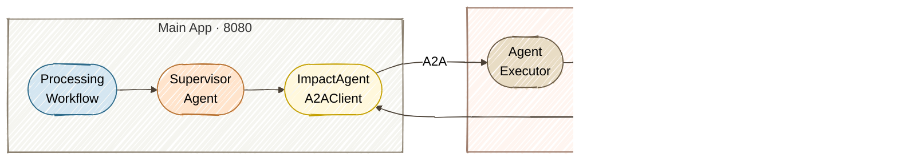

# Exercise 7 — Remote Agents (A2A)

<span class="badge badge--run-read">Run + Read</span>

**Timebox:** 10 minutes  
**Persona:** Riley — SRE team lead  
**You work in:** `solutions/07-a2a/` (run + read)

!!! tip "Reference solution"
    [`solutions/07-a2a`](https://github.com/danieloh30/techxchange-2026-quarkus-bob-lab/tree/main/solutions/07-a2a){:target="_blank"}

---

## The problem

In Exercise 4, every agent ran inside a single process — same JVM, same release cycle, same crash domain. But Riley's SRE team needs `ImpactAgent` as a **remote agent**: independent repo, independent release cadence, independently scalable, and reusable by other systems beyond Apex Systems.

**Solution:** convert `ImpactAgent` into a **remote agent** using the A2A (Agent-to-Agent) protocol — the local interface stays the same, but execution happens in a separate process.

!!! info "Why run + read instead of code-along?"
    A2A requires **two separate Quarkus projects** — a remote agent server (`:8888`) and a client that discovers it via `/.well-known/agent-card.json`. Setting up cross-project dependencies, A2A agent cards, and the client-side `@A2AClientAgent` wiring in a 10-minute timebox would be mostly configuration, not learning. Running the working solution lets you focus on **how A2A works** — AgentCard discovery, task delegation, and the network boundary — rather than debugging multi-module Maven setup.

---

## Start (two terminals) (3 min)

Stop any running Quarkus process first (`Ctrl+C`). Open **two separate terminals** at the repo root and run one command block in each:

=== "Terminal 1 — impact assessment service (start first)"

    ```bash
    cd solutions/07-a2a/remote-a2a-agent
    ./mvnw quarkus:dev   # port :8888
    ```

=== "Terminal 2 — main system"

    ```bash
    cd solutions/07-a2a/multi-agent-system
    ./mvnw quarkus:dev   # port :8080
    ```

!!! warning "Start order matters"
    Wait until Terminal 1 shows `Listening on: http://localhost:8888` before starting Terminal 2. The main system discovers the remote agent via its AgentCard at startup — if the remote agent isn't ready, the A2A call will fail.

Verify the AgentCard:
```bash
curl -s http://localhost:8888/.well-known/agent-card.json | jq
```

Expected:
```json
{
  "name": "impact-agent",
  "description": "Estimates business impact and SLA cost for incident escalation decisions",
  "version": "1.0.0",
  "capabilities": {
    "streaming": true,
    "pushNotifications": false
  },
  "defaultInputModes": ["text"],
  "defaultOutputModes": ["text"],
  "skills": [
    {
      "id": "impact-assessment",
      "name": "Business impact assessment",
      "description": "Estimates business impact and SLA cost for incident escalation decisions",
      "tags": ["impact-assessment", "sla-analysis"]
    }
  ],
  "url": "http://localhost:8888/",
  "preferredTransport": "JSONRPC"
}
```

!!! tip "Agentic Dev UI"
    Open the [Agentic Dev UI](http://localhost:8080/q/dev-ui/quarkus-langchain4j-agentic/agents){:target="_blank"} on the main system (:8080). Notice `ImpactAgent` now shows as **A2AClientAgent** (red badge) instead of a local `Agent` — the framework transparently proxies calls to the remote service.

    

    After processing an incident, open **Executions** and select **`IncidentProcessingWorkflow`** in the **Root Agent** dropdown. The [Try it](#try-it-3-min) section below walks through execution history and the app's own topology report. Compared with Exercise 4, `ImpactAgent` is still wired into the same workflow, but execution now happens in a separate JVM on port 8888.

!!! warning "A2A topology display error in quarkus-langchain4j 1.13.1"
    The Dev UI's [Topology](http://localhost:8080/q/dev-ui/quarkus-langchain4j-agentic/topology){:target="_blank"} tab can show `Failed to generate topology: Cannot read the array length because "args" is null` when you select `IncidentProcessingWorkflow`. This is an upstream graph-rendering issue involving the A2A client proxy; the message alone does not mean incident processing failed. After processing an incident, use the app's [system report](http://localhost:8080/incident-management/report){:target="_blank"} to view the topology, and the Dev UI's **Executions** tab to inspect the run.

---

## The A2A architecture (2 min)



**A2A concepts:**

| Concept | Meaning | Analogy |
|---------|---------|---------|
| AgentCard | Capability metadata | Service contract |
| AgentExecutor | Server-side request handler | JAX-RS endpoint |
| Task | Stateful goal with input/output | Async job |
| Message | Single synchronous exchange | REST call |

---

## Try it (3 min)

Open **[http://localhost:8080](http://localhost:8080){:target="_blank"}**, click **View** on an incident that will trigger escalation (e.g., Incident **#1**, payment-gateway/checkout-api), and process with:
```text
Complete service outage, all API endpoints returning 503, cascading failures across dependent services
```

**How to confirm:** The HITL approval modal will appear — click **Escalate to Management** to continue the workflow. Check the UI for the final incident status (should reach `ESCALATED`), then inspect the run using the views below.

### Open Dev UI execution history

1. Open **[Agentic Dev UI → Executions](http://localhost:8080/q/dev-ui/quarkus-langchain4j-agentic/executions){:target="_blank"}** on the main system (:8080). If you are already on the **Agents** or **Topology** tab, click **Executions** in the top navigation.
2. In the **Root Agent** dropdown at the top-left, select **`IncidentProcessingWorkflow`**.
3. Click **Refresh** if the page was open before the incident finished processing.
4. Expand the session/run and its agent rows to inspect the calls, durations, token counts, inputs, and outputs.

!!! note "Why are there two root agents, and why is the default empty?"
    Before the optional multimodal bonus, this exercise has two roots: **`IncidentProcessingWorkflow`**, which handles incidents, and **`IncidentLogAnalysisAgent`**, the standalone screenshot-analysis agent that has not yet been added to the workflow. Dev UI lists roots alphabetically and selects `IncidentLogAnalysisAgent` first. Its execution history is empty because processing an incident does not invoke it. Select **`IncidentProcessingWorkflow`** to see your run. Once you wire the bonus agent into the workflow, it becomes a child of that workflow.

### View the app's topology and execution report

Open **[http://localhost:8080/incident-management/report](http://localhost:8080/incident-management/report){:target="_blank"}** to view the app's own report, generated from the workflow's `agentMonitor()`. The **System Topology** view shows `processIncident` at the root, with parallel analysis, the supervisor and remote `impact-agent`, human approval, and resolution below it:


Scroll below **System Topology** to **Execution History** in the same report, then expand a session and its agent rows:


Notice the execution tree: `processIncident` (SEQUENCE) → `analyzeIncident` (PARALLEL, 3 analysis agents) → `superviseIncidentProcessing` (SEQUENCE with `impact-agent`, `processEscalation`) → `createEscalationProposal` → `analyzeForResolution`. Each row shows duration, token count, input, and output.

!!! tip "Execution history is kept in memory"
    Process an incident before inspecting execution history. Restarting or hot-reloading the main app clears the recorded runs; process another incident if the selected workflow's history is empty afterward.

Also correlate logs across **both** terminal windows:

- **Terminal 2 (8080):** look for `impact-agent` invocation — confirms the supervisor delegated to the A2A agent
- **Terminal 1 (8888):** look for `Remote A2A ImpactAgent called` and the response (e.g., `Estimated Impact: $36,000`)
- **Terminal 2 (8080):** look for `HITL Tool: Creating escalation approval proposal` — confirms the workflow continued after the A2A round-trip

The key observation: `impact-agent` appears in the execution tree on port 8080, but it actually ran in a separate JVM on port 8888 via A2A.

---

## MCP vs A2A — when to use each (1 min)

You haven't built an MCP integration in this lab, but the distinction matters for architecture decisions:

| | MCP (Model Context Protocol) | A2A (Agent-to-Agent) |
|--|-----|-----|
| **What crosses the wire** | Tool call (function + typed args) | Agent task (goal + natural language) |
| **Who reasons** | Local LLM uses remote tool | Remote LLM reasons independently |
| **Team ownership** | Shared capability (weather, search, DB lookup) | Autonomous team agent (impact assessment, legal review) |
| **State** | Stateless per call | Optionally stateful (task lifecycle) |
| **Best for** | Shared functionality any agent can call | Delegated decision-making by another team |
| **Quarkus annotation** | `@McpToolBox("name")` | `@A2AClientAgent` |

**Rule of thumb:** If the remote service just *does something* when told exactly what to do → MCP. If it *decides something* using its own reasoning → A2A.

---

## Trade-offs (1 min)

| Factor | Local agent (Ex 4) | Remote A2A agent |
|--------|-------------|-----------------|
| **Latency** | In-process | HTTP round-trip |
| **Ownership** | Shared codebase | Independent repo + release |
| **Scaling** | Scale whole app | Scale impact service independently |
| **Failure mode** | Shared crash domain | Network partition risk |
| **Reuse** | Single app | Any A2A-compatible client |

!!! tip "When to go remote"
    Start local. Extract to A2A when the agent needs **independent scaling**, **separate ownership** (another team maintains it), or **cross-system reuse** (multiple apps call the same agent). The network hop is a real cost — don't pay it unless you get one of these benefits.

Stop both Quarkus processes (`Ctrl+C` in each terminal) before moving to Exercise 8 — or keep them running for the optional **Bonus — Multimodal log analysis** at the end of this page.

---

<div class="done-when" markdown>

## :material-check-circle: Done when

- [ ] A2A: impact assessment ran in `:8888` (confirmed in remote process logs)
- [ ] AgentCard verified via `curl`
- [ ] You can contrast MCP vs A2A in one sentence each
- [ ] You can explain when to keep an agent local vs make it remote
- [ ] *(Bonus)* `IncidentLogAnalysisAgent` wired in, and an uploaded log screenshot enriched the report

</div>

---

## Bonus — Multimodal log analysis (optional, +5 min)

<span class="badge badge--code-along">Code</span>

!!! note "Optional bonus — separate from A2A"
    This task is about **multimodal input** (an agent that *reads an image*), which is
    independent of the A2A material above and adds ~5 min beyond the 10-min exercise.
    It lives here only because the complete incident-management app is in this exercise —
    skip it freely without missing anything about remote agents. You'll need **both**
    Quarkus processes still running (or restart them).

During a real incident, an SRE rarely has a clean written report — they have a **screenshot**: a log console, a Grafana panel, a stack trace. In this task you'll let the system *read that image* by wiring in a multimodal agent, then feed it a picture instead of prose.

The incident detail panel already has a **Choose File** button (`accept="image/*"`), and `IncidentLogAnalysisAgent` already exists — but it isn't wired into the workflow yet, so the upload currently has **no effect**. You'll connect it.

### How it works

`IncidentLogAnalysisAgent` is a vision agent: it takes the current `report` plus an `ImageContent`, sends both to the multimodal model (`gpt-4o`), and rewrites the report with what it sees — merged into a single description.

```java title="IncidentLogAnalysisAgent.java (already in the project)"
@SystemMessage("""
    You are a log analysis specialist... If a screenshot of logs, dashboards, or error
    messages is provided, analyze it and rewrite the incident report taking account of
    your visual observations (error patterns, stack traces, resource utilization,
    anomalous metrics, alert states, etc.)...
    """)
@UserMessage("Report: {report}")
@Agent(description = "Enriches incident reports with visual observations from log screenshots.",
        outputKey = "report", optional = true)   // (1)
String analyzeIncidentLogs(String report, @UserMessage @V("logImage") ImageContent logImage);
```

1. `outputKey = "report"` means this agent **overwrites** the `report` variable. So it must run **before** the parallel analysis reads it — i.e. it has to be the first step in the sequence.

### Your task

Open `solutions/07-a2a/multi-agent-system/src/main/java/com/incidentmanagement/agentic/workflow/IncidentProcessingWorkflow.java` and add `IncidentLogAnalysisAgent.class` as the **first** sub-agent (there's a `TODO` marking the spot):

=== "Before"

    ```java
    @SequenceAgent(outputKey = "incidentProcessingAgentResult",
            subAgents = {
                          IncidentAnalysisWorkflow.class,
                          IncidentSupervisorAgent.class,
                          EscalationProposalAgent.class,
                          HumanApprovalAgent.class,
                          ResolutionAgent.class })
    ```

=== "After"

    ```java
    @SequenceAgent(outputKey = "incidentProcessingAgentResult",
            subAgents = {
                          IncidentLogAnalysisAgent.class,   // (1) runs first, enriches "report"
                          IncidentAnalysisWorkflow.class,
                          IncidentSupervisorAgent.class,
                          EscalationProposalAgent.class,
                          HumanApprovalAgent.class,
                          ResolutionAgent.class })
    ```

    1. Add the import too: `import com.incidentmanagement.agentic.agents.IncidentLogAnalysisAgent;`

!!! info "Why first?"
    The sequence passes variables by name through the agentic scope. `logImage` enters at `processIncident(...)`; the vision agent consumes it and rewrites `report`; every downstream agent (parallel analysis, supervisor, resolution) then works from the *enriched* report. Put it anywhere later and the analysis would already have run on the raw text.

Save — Quarkus dev mode hot-reloads. (If you edited while stopped, restart Terminal 2 with `./mvnw quarkus:dev`.)

### Try it with a log screenshot

A ready-made sample screenshot ships with the project — a mock observability console for the checkout-api 503 incident (real, readable text so the model can actually parse it):


1. Open **[http://localhost:8080](http://localhost:8080){:target="_blank"}** and click **View** on Incident **#1** (payment-gateway / checkout-api).
2. Click **Choose File** and select `solutions/07-a2a/multi-agent-system/sample-data/checkout-api-503-incident.png`.
3. Leave the report box **empty** (or add a short note) and process the incident.

**How to confirm:** Open the [Dev UI's Executions page](http://localhost:8080/q/dev-ui/quarkus-langchain4j-agentic/executions){:target="_blank"} for **`IncidentProcessingWorkflow`** (select it in **Root Agent** if a dropdown is shown), or scroll to **Execution History** in the [app's system report](http://localhost:8080/incident-management/report){:target="_blank"}. Under `processIncident`, the first step is now `analyzeIncidentLogs`, and its output `report` contains details that only appear in the image — HikariCP connection-pool exhaustion (50/50, 128 waiting), upstream `payment-processor` timeouts, and the circuit breaker in `OPEN` state. Those observations then flow into severity/impact analysis and the escalation decision.

!!! tip "Compare with and without the image"
    Process once with no file and once with the screenshot. Same incident, but the enriched run gives the downstream agents far more to reason about — that's the multimodal payoff.

!!! warning "Vision needs a multimodal model"
    This works because `application.properties` uses `gpt-4o`. A text-only model would reject the `ImageContent`. `IncidentLogAnalysisAgent` is `optional = true`, so if no image is uploaded it returns the report unchanged and the workflow proceeds normally.

When you're done, stop both Quarkus processes (`Ctrl+C` in each terminal) before moving to Exercise 8.
