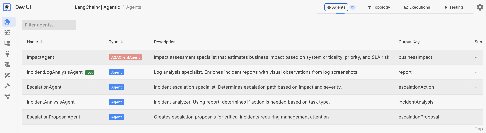
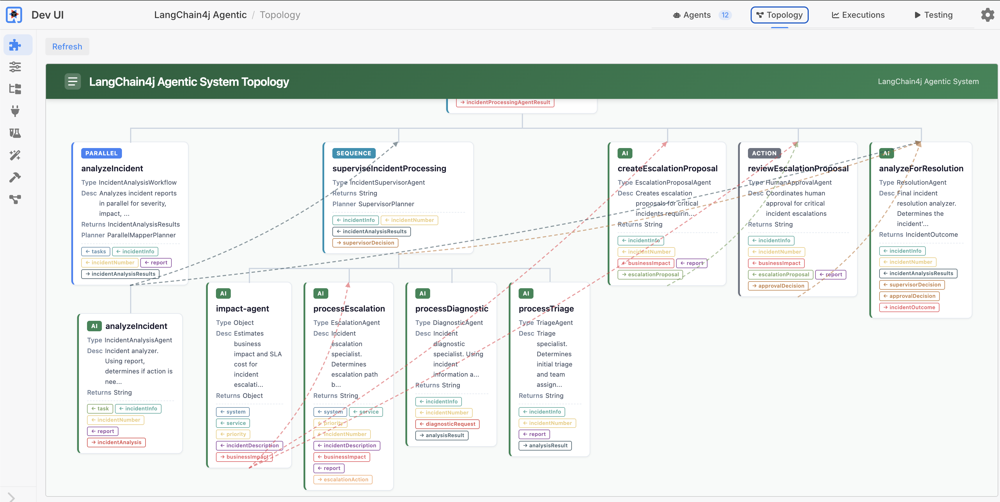
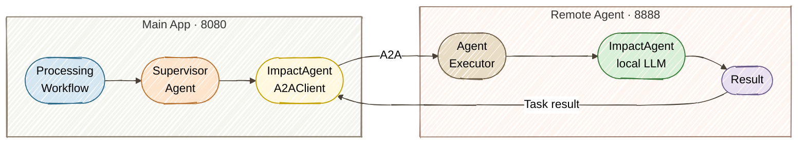

# Exercise 7 — Remote Agents (A2A)

<span class="badge badge--run-read">Run + Read</span>

**Timebox:** 10 minutes  
**Persona:** Riley — SRE team lead  
**You work in:** `exercises/07-a2a/solution/` (run + read)

!!! tip "Reference solution"
    [`exercises/07-a2a/solution`](https://github.com/danieloh30/techxchange-2026-quarkus-bob-lab/tree/main/exercises/07-a2a/solution){:target="_blank"}

---

## The problem

In Exercise 4, every agent ran inside a single process — same JVM, same release cycle, same crash domain. But Riley's SRE team needs `ImpactAgent` as a **remote agent**: independent repo, independent release cadence, independently scalable, and reusable by other systems beyond Apex Systems.

**Solution:** convert `ImpactAgent` into a **remote agent** using the A2A (Agent-to-Agent) protocol — the local interface stays the same, but execution happens in a separate process.

!!! info "Why run + read instead of code-along?"
    A2A requires **two separate Quarkus projects** — a remote agent server (`:8888`) and a client that discovers it via `/.well-known/agent-card.json`. Setting up cross-project dependencies, A2A agent cards, and the client-side `@A2AClientAgent` wiring in a 10-minute timebox would be mostly configuration, not learning. Running the working solution lets you focus on **how A2A works** — AgentCard discovery, task delegation, and the network boundary — rather than debugging multi-module Maven setup.

---

## Start (two terminals) (3 min)

Stop any running Quarkus process first (`Ctrl+C`).

=== "Terminal 1 — impact assessment service (start first)"

    ```bash
    cd exercises/07-a2a/solution/remote-a2a-agent
    ./mvnw quarkus:dev   # port :8888
    ```

=== "Terminal 2 — main system"

    ```bash
    cd exercises/07-a2a/solution/multi-agent-system
    ./mvnw quarkus:dev   # port :8080
    ```

!!! warning "Start order matters"
    Wait until Terminal 1 shows `Listening on: http://localhost:8888` before starting Terminal 2. The main system discovers the remote agent via its AgentCard at startup — if the remote agent isn't ready, the A2A call will fail.

Verify the AgentCard:
```bash
curl -s http://localhost:8888/.well-known/agent-card.json | jq
```

Expected:
```json
{
  "name": "impact-agent",
  "description": "Estimates business impact and SLA cost for incident escalation decisions",
  "version": "1.0.0",
  "capabilities": {
    "streaming": true,
    "pushNotifications": false
  },
  "defaultInputModes": ["text"],
  "defaultOutputModes": ["text"],
  "skills": [
    {
      "id": "impact-assessment",
      "name": "Business impact assessment",
      "description": "Estimates business impact and SLA cost for incident escalation decisions",
      "tags": ["impact-assessment", "sla-analysis"]
    }
  ],
  "url": "http://localhost:8888/",
  "preferredTransport": "JSONRPC"
}
```

!!! tip "Agentic Dev UI"
    Open the [Agentic Dev UI](http://localhost:8080/q/dev-ui/quarkus-langchain4j-agentic/agents){:target="_blank"} on the main system (:8080). Notice `ImpactAgent` now shows as **A2AClientAgent** (red badge) instead of a local `Agent` — the framework transparently proxies calls to the remote service.

    

    Check the [topology](http://localhost:8080/q/dev-ui/quarkus-langchain4j-agentic/topology){:target="_blank"} — this is the final evolution of the agent tree. Compare it to Exercise 4: `ImpactAgent` is still wired into the same workflow, but execution now happens in a separate JVM on port 8888.

    

---

## The A2A architecture (2 min)



**A2A concepts:**

| Concept | Meaning | Analogy |
|---------|---------|---------|
| AgentCard | Capability metadata | Service contract |
| AgentExecutor | Server-side request handler | JAX-RS endpoint |
| Task | Stateful goal with input/output | Async job |
| Message | Single synchronous exchange | REST call |

---

## Try it (3 min)

Open **[http://localhost:8080](http://localhost:8080){:target="_blank"}**, click **View** on an incident that will trigger escalation (e.g., Incident **#1**, payment-gateway/checkout-api), and process with:
```text
Complete service outage, all API endpoints returning 503, cascading failures across dependent services
```

**How to confirm:** Check the UI for the final incident status (should reach `ESCALATED`). Then correlate logs across **both** terminal windows:

- **Terminal 2 — Client (8080):** look for `Agent Invocation: AgentInvocation{agentName='impact-agent$0$1', arguments={system=payment-gateway, ...}}` — confirms the supervisor delegated to the A2A agent
- **Terminal 1 — Remote (8888):** look for `Remote A2A ImpactAgent called` and the response (e.g., `ImpactAgent response: Estimated Impact: $36,000`)
- **Terminal 2 — Client (8080):** look for `HITL Tool: Creating escalation approval proposal` — confirms the workflow continued after the A2A round-trip

The key observation: the same `ImpactAgent` interface runs, but execution happened in a completely separate JVM on port 8888.

---

## MCP vs A2A — when to use each (1 min)

You haven't built an MCP integration in this lab, but the distinction matters for architecture decisions:

| | MCP (Model Context Protocol) | A2A (Agent-to-Agent) |
|--|-----|-----|
| **What crosses the wire** | Tool call (function + typed args) | Agent task (goal + natural language) |
| **Who reasons** | Local LLM uses remote tool | Remote LLM reasons independently |
| **Team ownership** | Shared capability (weather, search, DB lookup) | Autonomous team agent (impact assessment, legal review) |
| **State** | Stateless per call | Optionally stateful (task lifecycle) |
| **Best for** | Shared functionality any agent can call | Delegated decision-making by another team |
| **Quarkus annotation** | `@McpToolBox("name")` | `@A2AClientAgent` |

**Rule of thumb:** If the remote service just *does something* when told exactly what to do → MCP. If it *decides something* using its own reasoning → A2A.

!!! example "Optional self-study: Try MCP"
    The [`exercises/05-ibm-bob/`](https://github.com/danieloh30/techxchange-2026-quarkus-bob-lab/tree/main/exercises/05-ibm-bob){:target="_blank"} folder contains a working MCP weather server (`weather-mcp-server/`) and MCP client app (`solution/`). Start both and see `@McpToolBox` in action — a car rental chatbot that calls a remote weather forecast tool over SSE.

---

## Trade-offs (1 min)

| Factor | Local agent (Ex 4) | Remote A2A agent |
|--------|-------------|-----------------|
| **Latency** | In-process | +HTTP round-trip |
| **Ownership** | Shared codebase | Independent repo + release |
| **Scaling** | Scale whole app | Scale impact service independently |
| **Failure mode** | Shared crash domain | Network partition risk |
| **Reuse** | Single app | Any A2A-compatible client |

!!! tip "When to go remote"
    Start local. Extract to A2A when the agent needs **independent scaling**, **separate ownership** (another team maintains it), or **cross-system reuse** (multiple apps call the same agent). The network hop is a real cost — don't pay it unless you get one of these benefits.

---

<div class="done-when" markdown>

## :material-check-circle: Done when

- [ ] A2A: impact assessment ran in `:8888` (confirmed in remote process logs)
- [ ] AgentCard verified via `curl`
- [ ] You can contrast MCP vs A2A in one sentence each
- [ ] You can explain when to keep an agent local vs make it remote

</div>
