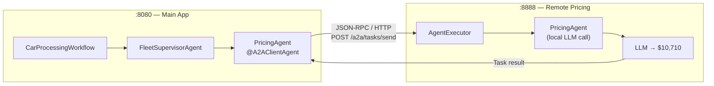

# Exercise 7 — A2A: Distributed Pricing Agent

<span class="badge badge--run-read">Run + Read</span>

**Timebox:** 10 minutes  
**Persona:** Riley — Pricing team lead  
**You work in:** `exercises/07-a2a/solution/` (run + read)

!!! tip "Reference solution"
    [`exercises/07-a2a/solution`](https://github.com/danieloh30/techxchange-2026-quarkus-bob-lab/tree/main/exercises/07-a2a/solution)

---

## The problem

In Exercise 4, `PricingAgent` ran inside the main app — same process, same release cycle. But Riley's pricing team needs independent ownership: their own repo, their own release cadence, and the ability to serve other IBM systems beyond Miles of Smiles.

Solution: convert `PricingAgent` into an **Agent-to-Agent (A2A)** remote service.

---

## Start (two terminals)

Stop any running Quarkus process first (`Ctrl+C`).

=== "Terminal 1 — pricing service (start first)"

    ```bash
    cd exercises/07-a2a/solution/remote-a2a-agent
    ./mvnw quarkus:dev   # port :8888
    ```

=== "Terminal 2 — main system"

    ```bash
    cd exercises/07-a2a/solution/multi-agent-system
    ./mvnw quarkus:dev   # port :8080
    ```

Verify the AgentCard:
```bash
curl http://localhost:8888/.well-known/agent.json
```

Expected:
```json
{
  "name": "pricing-agent",
  "description": "Estimates car market value for fleet disposition decisions",
  "url": "http://localhost:8888/a2a",
  "capabilities": ["pricing", "valuation"]
}
```

---

## The A2A architecture



**A2A concepts:**

| Concept | Meaning | Analogy |
|---------|---------|---------|
| `AgentCard` | Capability metadata — what can this agent do? | Service contract / OpenAPI spec |
| `AgentExecutor` | Request handler on the server — processes an incoming `Task` | JAX-RS endpoint for agents |
| `Task` | Long-running, stateful goal with input/output envelope | Async job submission |
| `Message` | Single synchronous exchange within a task | Synchronous REST call |

---

## Try it

Return a car that requires valuation + disposition:
```text
High-mileage vehicle, transmission slipping, market value uncertain
```

Correlate logs across **both** processes:
- **Client (8080):** `[A2AClient] sending task to http://localhost:8888/a2a`
- **Remote (8888):** `[AgentExecutor] received task, invoking PricingAgent`
- **Remote (8888):** `[PricingAgent] estimated value: $7,200`
- **Client (8080):** `[A2AClient] task completed, result: $7,200`

---

## MCP vs A2A — when to use each

You haven't built an MCP integration in this lab, but the distinction matters for architecture decisions:

| | MCP (Model Context Protocol) | A2A (Agent-to-Agent) |
|--|-----|-----|
| **What crosses the wire** | Tool call (function + typed args) | Agent task (goal + natural language) |
| **Who reasons** | Local LLM uses remote tool | Remote LLM reasons independently |
| **Team ownership** | Shared capability (weather, search, DB lookup) | Autonomous team agent (pricing, legal review) |
| **State** | Stateless per call | Optionally stateful (task lifecycle) |
| **Best for** | Shared functionality any agent can call | Delegated decision-making by another team |
| **Quarkus annotation** | `@McpToolBox("name")` | `@A2AClientAgent` |

**Rule of thumb:** If the remote service just *does something* when told exactly what to do → MCP. If it *decides something* using its own reasoning → A2A.

!!! example "Stretch: Try MCP"
    The [`exercises/05-mcp/`](https://github.com/danieloh30/techxchange-2026-quarkus-bob-lab/tree/main/exercises/05-mcp) folder contains a working MCP weather server and client. Run both and see `@McpToolBox` in action as a stretch exercise.

---

## Trade-offs

| Factor | Local agent (Ex 4) | Remote A2A agent |
|--------|-------------|-----------------|
| Latency | In-process | +HTTP round-trip |
| Ownership | Shared codebase | Independent repo + release |
| Scaling | Scale whole app | Scale pricing service independently |
| Failure mode | Shared crash domain | Network partition risk |
| Reuse | Single app | Any A2A-compatible client |

---

<div class="done-when" markdown>

## :material-check-circle: Done when

- [ ] A2A: pricing ran in `:8888` (confirmed in remote process logs)
- [ ] AgentCard verified via `curl`
- [ ] You can contrast MCP vs A2A in one sentence each
- [ ] You can explain when to keep an agent local vs make it remote

</div>
