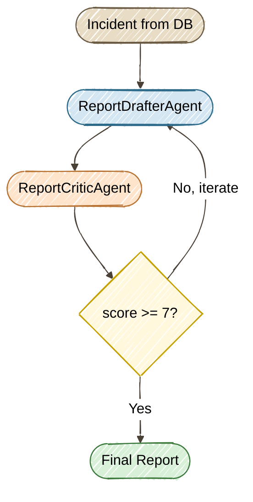

# Exercise 8 — Programmatic Orchestration: Quality Loop (Bonus)

<span class="badge badge--code-along">Code-Along</span> <span class="badge" style="background:#6B5B8A;color:white;">Bonus</span>

**Timebox:** 15 minutes (self-paced)  
**Persona:** Jordan — Java platform engineer  
**You work in:** `exercises/08-quarkus-flow/solution/`  
**Files to edit:**

- `src/.../agentic/agents/ReportDrafterAgent.java`
- `src/.../agentic/agents/ReportCriticAgent.java`
- `src/.../agentic/workflow/IncidentReportFlow.java`

!!! tip "Full solution"
    If stuck, the completed files are in [`exercises/08-quarkus-flow/solution-complete/`](https://github.com/danieloh30/techxchange-2026-quarkus-bob-lab/tree/main/exercises/08-quarkus-flow/solution-complete){:target="_blank"} — copy them over your TODO files and restart.

---

## Why programmatic orchestration?

In Exercises 1–4 you used **declarative annotations** — `@SequenceAgent`, `@ParallelMapperAgent`, `@SupervisorAgent` — to wire agents. These are powerful but have a limitation: **they can't loop.** A `@SequenceAgent` runs its sub-agents once and stops. A `@SupervisorAgent` routes to sub-agents via LLM reasoning, but there's no deterministic "retry until quality passes."

This exercise introduces **programmatic orchestration** using LangChain4j's builder API backed by [Quarkus Flow](https://docs.quarkiverse.io/quarkus-flow/dev/index.html){:target="_blank"} — a CNCF Serverless Workflow engine. The builder pattern lets you express loops, conditions, and exit criteria in plain Java:

```java
AgenticServices.loopBuilder()
    .maxIterations(3)
    .exitCondition((scope, iteration) -> scope.readState("score", 0) >= 7)
    .subAgents(draftAction, critiqueAction)
    .build();
```

---

## The scenario

After an incident is resolved, someone needs to write the **post-incident report (PIR)**. You'll build a workflow that **generates, critiques, and iteratively refines** the report until quality passes a threshold:



**This is impossible with declarative annotations.** There is no `@LoopAgent` — the loop exists only in the programmatic builder API.

---

## Step 0 — Start the project (2 min)

Stop any running Quarkus process (`Ctrl+C`), then:

```bash
cd exercises/08-quarkus-flow/solution
export OPENAI_API_KEY=sk-your-key-here
./mvnw quarkus:dev
```

Wait for `Listening on: http://localhost:8080`.

!!! info "New dependency"
    Check `pom.xml` — this project adds `quarkus-flow-langchain4j`, which provides the `AgenticServices.loopBuilder()` runtime backed by the CNCF Serverless Workflow engine.

---

## Step 1 — Implement the agents (5 min)

### Step 1a — ReportDrafterAgent

Open `src/.../agentic/agents/ReportDrafterAgent.java`. Replace the `// TODO Exercise 08 — Step 1a` block with:

```java
    @SystemMessage("""
            You are a post-incident report writer for an IT incident management system.
            Write a clear, structured post-incident report (PIR) covering:
            1. Incident Summary (system, service, priority, what happened)
            2. Timeline (when detected, key milestones)
            3. Root Cause Analysis
            4. Impact Assessment
            5. Resolution Steps Taken
            6. Preventive Measures / Action Items

            If you receive reviewer feedback from a previous draft, incorporate the feedback
            to improve the report. Keep the report concise (under 500 words).
            Output ONLY the report text.
            """)
    @UserMessage("""
            Write a post-incident report for:
            - System: {system}
            - Service: {service}
            - Priority: {priority}
            - Description: {description}
            - Status: {status}

            Reviewer feedback from previous draft:
            {feedback}
            """)
```

This agent is a standard `@RegisterAiService` bean — the same pattern as Exercises 1–4. The key difference: it accepts a `feedback` parameter so the loop can feed critic feedback back into the next draft.

### Step 1b — ReportCriticAgent

Open `src/.../agentic/agents/ReportCriticAgent.java`. Replace the `// TODO Exercise 08 — Step 1b` block with:

```java
    @SystemMessage("""
            You are a quality reviewer for post-incident reports (PIRs).
            Evaluate the report on these criteria:
            - Completeness: Does it cover summary, timeline, root cause, impact, resolution, and action items?
            - Clarity: Is it clear and free of unnecessary jargon?
            - Actionability: Are the preventive measures specific and assignable?
            - Accuracy: Does the report match the incident details provided?

            Scoring guide:
            - 1-3: Missing major sections or factual errors
            - 4-6: Incomplete sections or vague action items
            - 7-8: Solid report with minor improvements possible
            - 9-10: Exemplary, ready for stakeholder distribution
            """)
    @UserMessage("""
            Evaluate this post-incident report for an incident on {system}/{service} ({priority}):

            --- REPORT START ---
            {report}
            --- REPORT END ---
            """)
```

Notice the return type is `ReportCritique` — a Java record with `score` and `feedback` fields. LangChain4j automatically instructs the LLM to respond in JSON and deserializes it.

---

## Step 2 — Build the loop workflow (5 min)

Open `src/.../agentic/workflow/IncidentReportFlow.java`. This is where the **programmatic orchestration** happens — no annotations, just Java code.

### Step 2a — Draft agent action

Replace the `// TODO Exercise 08 — Step 2a` block with:

```java
        var draftAction = AgenticServices.agentAction(scope -> {
            String feedback = scope.readState("feedback", "No previous feedback. Write the first draft.");
            int iteration = scope.readState("iteration", 0) + 1;
            scope.writeState("iteration", iteration);
            Log.infof("Report Draft — iteration %d", iteration);

            String report = drafterAgent.draftReport(
                    incident.system, incident.service, incident.priority,
                    incident.description != null ? incident.description : "",
                    incident.status.toString(), feedback);
            scope.writeState("report", report);
        });
```

**Key concept: `AgenticScope`** — a shared state bag that passes data between agents in the loop. Each agent reads what it needs and writes its output. On the next iteration, the drafter picks up the critic's `feedback` from scope.

### Step 2b — Critique agent action

Replace the `// TODO Exercise 08 — Step 2b` block with:

```java
        var critiqueAction = AgenticServices.agentAction(scope -> {
            String report = scope.readState("report", "");
            int iteration = scope.readState("iteration", 1);

            ReportCritique critique = criticAgent.critiqueReport(
                    incident.system, incident.service, incident.priority, report);

            scope.writeState("score", critique.score());
            scope.writeState("feedback", critique.feedback());
            Log.infof("Report Critique — iteration %d: score=%d, feedback=%s",
                    iteration, critique.score(), critique.feedback());
        });
```

### Step 2c — The loop

Replace the `// TODO Exercise 08 — Step 2c` block with:

```java
        UntypedAgent workflow = AgenticServices.loopBuilder()
                .name("incident-report-quality-loop")
                .maxIterations(3)
                .exitCondition((scope, iteration) -> {
                    int score = scope.readState("score", 0);
                    return score >= 7;
                })
                .subAgents(draftAction, critiqueAction)
                .build();

        var result = workflow.invokeWithAgenticScope(Map.of());
        return result.agenticScope().state();
```

**This is the "aha" moment.** `loopBuilder()` creates a workflow that:

1. Runs `draftAction` then `critiqueAction` (one iteration)
2. Checks the exit condition: is `score >= 7`?
3. If yes → returns the final state (report + score + feedback)
4. If no → loops back to `draftAction` with the critic's feedback in scope
5. Stops after at most 3 iterations regardless

Compare this with `@SequenceAgent` from Exercise 4 — that runs its sub-agents exactly once. There is no way to express "retry until quality passes" with annotations alone.

---

## Step 3 — Test it (3 min)

Hot reload should have picked up your changes. Generate a report for incident #1:

```bash
curl -s -X POST http://localhost:8080/incident-report/1 | jq
```

**Check the terminal logs** — you should see the loop in action:

```
Report Draft — iteration 1
Report Critique — iteration 1: score=5, feedback=Missing root cause analysis...
Report Draft — iteration 2
Report Critique — iteration 2: score=7, feedback=Solid report...
Report quality loop completed for incident #1 — final score: 7
```

The response JSON contains the full scope state: `report`, `score`, `feedback`, and `iteration`.

Try different incidents to see how the loop adapts:

```bash
curl -s -X POST http://localhost:8080/incident-report/2 | jq '.score, .iteration'
curl -s -X POST http://localhost:8080/incident-report/5 | jq '.score, .iteration'
```

---

## Annotations vs programmatic builders — when to use each

| | Declarative annotations | Programmatic builders |
|--|---|---|
| **Loops** | Not possible | `loopBuilder().exitCondition(...)` |
| **Conditionals** | `@ConditionalAgent` (single gate) | `conditionalBuilder()` (multi-branch) |
| **Data flow** | Automatic via `AgenticScope` keys | Explicit `scope.readState/writeState` |
| **Orchestration** | `@SequenceAgent`, `@ParallelMapperAgent`, `@SupervisorAgent` | `sequenceBuilder()`, `parallelBuilder()`, `loopBuilder()` |
| **Best for** | Standard agent pipelines | Complex control flow, retry logic |
| **Dev UI** | Full topology visualization | Workflow visible in Quarkus Flow Dev UI |

!!! tip "Start declarative, go programmatic when you need loops or complex branching"
    Annotations handle 80% of use cases. Switch to builders when you need deterministic loops, multi-branch conditionals, or mixed orchestration (agents + HTTP calls + events in one workflow).

---

<div class="done-when" markdown>

## :material-check-circle: Done when

- [ ] Report quality loop completed at least 1 iteration (logs show "Report Draft" and "Report Critique")
- [ ] Final report has score >= 7
- [ ] You can explain why `@SequenceAgent` cannot loop
- [ ] You can describe the `AgenticScope` read/write pattern for inter-agent communication

</div>
