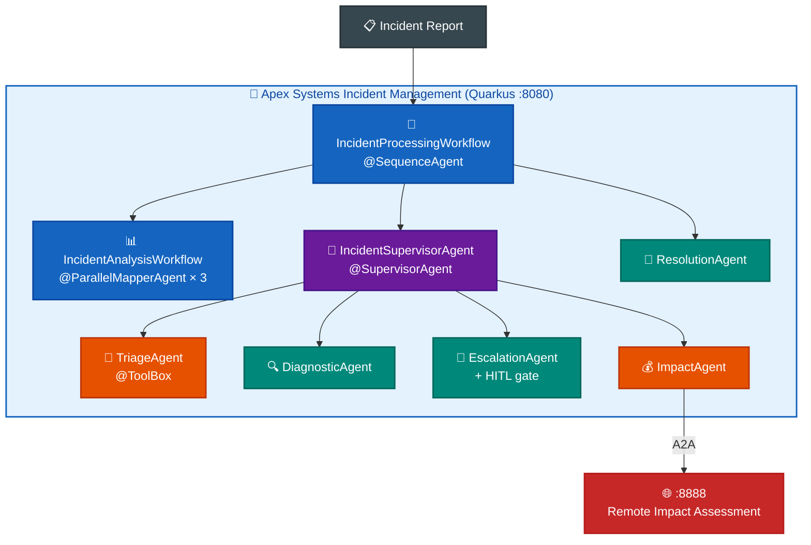
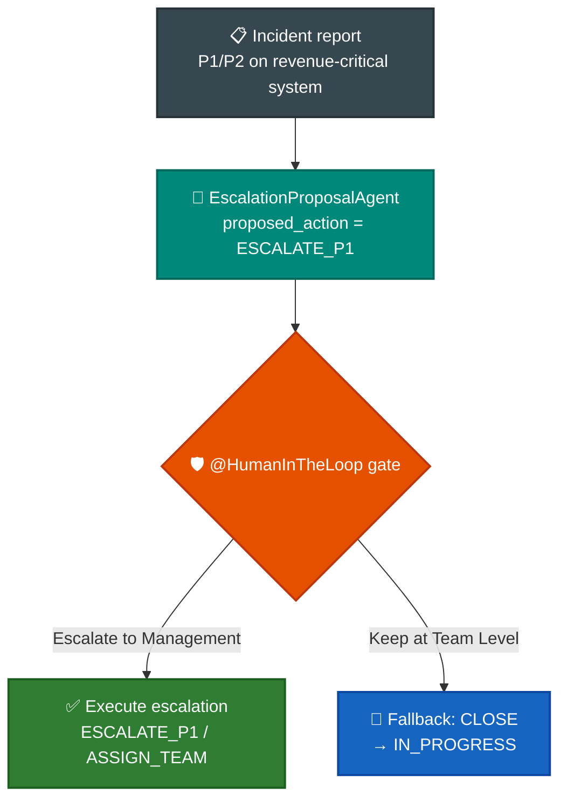

# LAB-1219 - Building Enterprise-Grade Agentic AI Systems with IBM Quarkus and Bob

**IBM TechXchange 2026 · Hands-On Lab**  
**Duration:** 90 minutes (10 min intro · 80 min hands-on)  
**Level:** Intermediate Java developer  
**Stack:** IBM Enterprise Build of Quarkus · Quarkus LangChain4j · IBM Bob · A2A

---

## Lab at a Glance

| Block | Time | Cumulative | Focus |
|-------|------|------------|-------|
| Intro presentation | 10 min | :10 | Story, architecture, what you will build |
| Exercise 1 | 15 min | :25 | **Code-along** — `TriageAgent` + `TriageTool` (your first agent) |
| Exercise 2 | 10 min | :35 | **Code-along** — `DiagnosticAgent` + live `@SystemMessage` tuning |
| Exercise 3 | 10 min | :45 | **Code-along** — `@ParallelMapperAgent` + `@Output` + `AgenticScope` |
| Exercise 4 | 15 min | :60 | **Code-along** — full supervisor pipeline: impact, escalation, sequence |
| Exercise 5 | 10 min | :70 | **IBM Bob** + `AGENTS.md` — govern and document what you built |
| Exercise 6 | 10 min | :80 | Human-in-the-loop + OpenTelemetry observability |
| Exercise 7 | 10 min | :90 | A2A — distributed impact assessment agent |

!!! note "How this lab works"
    **Working project:** `lab/` — a single Quarkus starter you build incrementally across Exercises 1–4.  
    **Exercises 1–4 are direct code-along:** open each stub file, read the `// TODO` comments, and type in the code shown in the guide. Hot reload keeps Quarkus running.  
    **Exercise 5** uses IBM Bob to document and validate the agents you built.  
    **Exercises 6–7** run pre-built solutions to explore HITL, observability, and A2A patterns.  
    Reference solutions in `exercises/` are fallbacks — linked at the top of each exercise guide.

---

## Prerequisites

Before the lab starts, confirm:

| Requirement | Check |
|-------------|-------|
| **Java 25+** (`java -version`) | ✓ |
| **Maven 3.9+** (or use included `./mvnw`) | ✓ |
| **IBM Enterprise Build of Quarkus** / Quarkus **3.37.4** | ✓ |
| **IBM Bob** installed and signed in ([bob.ibm.com](https://bob.ibm.com/)) | ✓ |
| LLM API key — instructors provide `OPENAI_API_KEY` or lab endpoint | ✓ |
| Ports **8080**, **8888** free | ✓ |
| Git clone of this repo (see below) | ✓ |
| Docker or Podman (for Quarkus Dev Services) | ✓ |

Optional but recommended:
- IDE with Bob plugin (VS Code / JetBrains / Bob IDE) — Tab-complete for agent prompts
- Browser tabs pre-opened: `localhost:8080` (app UI), Grafana Dev Service (Exercise 6)
- Second terminal ready for Exercise 7 (A2A two-process setup)

---

## Getting the Code

```bash
git clone https://github.com/danieloh30/techxchange-2026-quarkus-bob-lab.git
cd techxchange-2026-quarkus-bob-lab
export OPENAI_API_KEY=sk-your-lab-key-here   # or lab-provided endpoint variables
```

Repository layout:

```text
AGENTS.md                             # Bob project context file (token-efficiency)
lab/                                  # Your working Quarkus project (stub files)
docs/                                 # All lab instructions + images
├── LAB_GUIDE.md                      # This file
├── 00-intro/ … 07-a2a/               # Per-exercise START_HERE.md + Bob materials
└── images/

exercises/                            # Completed Quarkus solution projects
├── 01-first-agents/solution
├── 02-workflow-patterns/{solution-sequence, solution-composed}
├── 03-supervisor/solution
├── 04-ibm-bob/solution
├── 05-mcp/{solution, weather-mcp-server}
├── 06-hitl-observability/{solution, observability-reference}
└── 07-a2a/solution/{multi-agent-system, remote-a2a-agent}
```

---

# Part 0 — Intro Presentation (10 minutes)

## Slide narrative for instructors

### The company: Apex Systems

**Apex Systems** is a mid-size enterprise IT services company managing infrastructure across data centers and cloud regions. The NOC (Network Operations Center) receives free-text incident reports from monitoring tools, tickets, and on-call engineers. Today those reports live in chat threads, email chains, and tribal knowledge.

Last quarter's post-mortem:
- Three P1 outages lasted **4+ hours due to P3 misclassification** — $200k revenue loss
- Two incidents were **escalated to the wrong engineering team**, wasting 40 engineer-hours
- Service managers cannot see *why* an incident was routed `OPEN → TRIAGING → IN_PROGRESS → RESOLVED` or whether it should have been escalated (`ESCALATE_P1` / `ASSIGN_TEAM` / `WORKAROUND` / `CLOSE`)

Leadership mandate:

> **Automate incident triage and routing with AI agents — without losing enterprise control.**

### Why agentic AI (not "just a chatbot")

| Chatbot | Agent |
|---------|-------|
| Answers questions | Takes actions |
| One turn | Multi-step reasoning |
| No side effects | Calls tools, mutates state |
| No memory between calls | Scope / context across workflow |
| Single model | Composed specialists |

Apex Systems needs systems that:

1. **Reason** over messy natural-language incident reports ("503 errors," "auth failure," "cascading outage")
2. **Act** by calling enterprise tools (update status, request triage, assess impact)
3. **Collaborate** across specialized roles (triage, diagnostic, impact, escalation)
4. **Pause** for humans on high-stakes outcomes — compliance requires it
5. **Scale** across teams via open protocols (A2A) without copy-pasting logic

### The story arc

| # | Persona | Pain point | Pattern you learn |
|---|---------|-----------|-------------------|
| 1 | **Sam** — NOC analyst | Free-text reports pile up; triage is manual | First agents + `@ToolBox` |
| 2 | **Chris** — Ops lead | Diagnostic decisions need policy, not code | `@SystemMessage` as policy |
| 3 | **Chris** — Ops lead | Three analyses must run concurrently | `@ParallelMapperAgent` |
| 4 | **Priya** — IT service mgr | Critical incidents need adaptive escalation | `@SupervisorAgent` orchestration |
| 5 | **Jordan** — Java platform engineer | Must ship governed code; copilots hallucinate | **IBM Bob** + AGENTS.md |
| 6 | **Alex** — Compliance officer | P1 incidents need approval + audit trail | **HITL** + OpenTelemetry |
| 7 | **Riley** — SRE lead | Impact assessment is a separate team | **A2A** remote impact agent |

### Architecture you will grow into



### IBM stack for this lab

| Layer | IBM component | Role |
|-------|--------------|------|
| Runtime | IBM Enterprise Build of Quarkus 3.37.4 | Build-time agent validation, fast startup |
| AI extension | Quarkus LangChain4j 1.12.0 | Declarative agents, workflows, A2A |
| Dev tooling | IBM Bob | SDLC partner: plan → code → test → secure |
| Context efficiency | `AGENTS.md` (project root) | Targeted Bob context — avoids token-bloat scans |

### Learning outcomes

After 80 minutes you will be able to:

- Declare agents with `@Agent`, `@SystemMessage`, `@ToolBox` and explain what Quarkus generates
- Compose multi-agent workflows: sequence, parallel, routing, loop
- Use `@SupervisorAgent` for adaptive AI orchestration vs hardcoded routing
- Author an `AGENTS.md` to make IBM Bob cost-efficient on agentic projects
- Decompose a monolithic agent into an independently owned service via **A2A**
- Add **human-in-the-loop** gates and read **OpenTelemetry** spans for compliance + FinOps

---

# Part 1 — Hands-On Lab (80 minutes)

---

## Exercise 1 — Your First Agent: TriageAgent + TriageTool (~15 min)

**Story:** Sam at the NOC processes incoming incident reports. The system must decide: triage and assign, or mark as no action needed?

**You work in:** `lab/` — start Quarkus here and keep it running.

**Goals**

- Declare your first `@Agent` interface: `@SystemMessage`, `@UserMessage`, `@ToolBox`
- Implement `TriageTool.requestTriage()` with `@Transactional` + JPA mutation
- Understand the agent loop: LLM decides → tool executes → LLM resumes

### 1.1 Start the lab project

```bash
cd lab
export OPENAI_API_KEY=sk-your-lab-key-here
./mvnw quarkus:dev
```

Open http://localhost:8080 — Incident Dashboard with 8 seeded incidents. Click the **View** button in the Action column to open the detail panel. Processing will fail — no agents are wired yet. That's Exercise 1.


### 1.2 Open the exercise guide

➡ **[docs/01-first-agent/START_HERE.md](01-first-agent/START_HERE.md)**

The guide shows you the exact code to type into each stub file and explains every annotation.

### 1.3 Hands-on checks

**Test 1 — Critical incident (tool should be called)**

Process Incident #5 (email-service/notification-api) with:
```text
Order confirmation emails failing for 30% of customers, bounce rate spiking
```

Expected result:
- Status → `TRIAGING`
- Logs show `TriageTool` called with `assignOnCall=true`

**Test 2 — False alarm (tool should NOT be called)**

Process Incident #6 (search-engine/product-search) with:
```text
False alarm, search relevance is back to normal after cache refresh
```

Expected result:
- Response contains `TRIAGE_NOT_REQUIRED`
- Status stays `RESOLVED`
- No `TriageTool` log line

### 1.4 Checkpoint

| ✓ | You can explain… |
|---|-----------------|
| ☐ | Why agents call tools instead of only returning text |
| ☐ | What `@ToolBox` does at the LLM decision layer vs the runtime layer |
| ☐ | The agent loop: request → optional tool call → final response |
| ☐ | Why this is an interface (not a class) |

---

## Exercise 2 — DiagnosticAgent + @SystemMessage as Policy (~10 min)

**Story:** Chris (ops) needs to go beyond triage decisions — incidents also need root cause analysis. He wants to understand how `@SystemMessage` threshold changes affect agent behavior without redeploying.

**You work in:** `lab/` (keep Quarkus running)

**Goals**

- Declare `DiagnosticAgent` — same `@Agent` pattern, but text-only output (no `@ToolBox`)
- Live `@SystemMessage` experiment: see how changing a string changes agent policy

### 2.1 Open the exercise guide

➡ **[docs/02-maintenance-agent/START_HERE.md](02-maintenance-agent/START_HERE.md)**

The guide walks you through the `@SystemMessage` content to type, the tuning experiment steps, and the comparison between text-only and tool-calling agents.

### 2.2 Checkpoint

| ✓ | You can explain… |
|---|-----------------|
| ☐ | When an agent needs `@ToolBox` vs when text-only output is correct |
| ☐ | Why `@SystemMessage` is a policy declaration, not code logic |
| ☐ | How you changed agent behavior by editing a string — no conditional logic |

---

## Exercise 3 — Parallel Workflow: @ParallelMapperAgent (~10 min)

**Story:** Chris needs severity, impact, AND resolution analysis — all three running concurrently to cut latency. One interface, three concurrent LLM calls, dynamic `@SystemMessage` per task.

**You work in:** `lab/` (keep Quarkus running)

**Goals**

- Declare `IncidentAnalysisAgent` with dynamic `@SystemMessage("{task.systemInstructions}")`
- Declare `IncidentAnalysisWorkflow` with `@ParallelMapperAgent` + `@Output` aggregation
- Understand `AgenticScope` data flow: how results flow from parallel workers to downstream agents

### 3.1 Open the exercise guide

➡ **[docs/03-parallel-workflow/START_HERE.md](03-parallel-workflow/START_HERE.md)**

The guide shows the exact code for both files and explains why `itemsProvider`, `outputKey`, and `@Output` each exist.

### 3.2 Pattern reference

| Pattern | Annotation | When to use |
|---------|------------|-------------|
| Sequence | `@SequenceAgent` | B needs output of A |
| Parallel fan-out | `@ParallelMapperAgent` | Same agent, multiple inputs, concurrent |
| Aggregation | `@Output` | Collect parallel results into a typed record |
| Routing | `@ConditionalAgent` | Different paths from runtime decision |

### 3.3 Checkpoint

| ✓ | You can explain… |
|---|-----------------|
| ☐ | How `@SystemMessage("{task.systemInstructions}")` enables one interface for 3 roles |
| ☐ | Why `@Output` is a static method, not an LLM call |
| ☐ | What `itemsProvider = "tasks"` tells the framework |
| ☐ | How `outputKey` wires parallel results to downstream agents |

---

## Exercise 4 — Full Supervisor Pipeline (~15 min)

**Story:** Priya (IT service mgr), Riley (SRE), and Sam (NOC) all need to work together on a single incident. A `@SupervisorAgent` decides which specialists to invoke. A `@SequenceAgent` chains the whole pipeline. Policy lives in prose, not `if/else`.

**You work in:** `lab/` (keep Quarkus running)

**Goals**

- Implement `ImpactAgent`, `EscalationAgent`, `ResolutionAgent`
- Implement `IncidentSupervisorAgent` with `@SupervisorAgent` + `@SupervisorRequest`
- Implement `IncidentProcessingWorkflow` with `@SequenceAgent` + `@Output`
- Verify all three test paths: minor incident, needs triage, critical escalation

### 4.1 Open the exercise guide

➡ **[docs/04-supervisor/START_HERE.md](04-supervisor/START_HERE.md)**

The guide provides exact code for all five files with step-by-step annotations and explanations.

### 4.2 Supervisor vs conditional routing

| | `@ConditionalAgent` | `@SupervisorAgent` |
|---|---|---|
| Decision logic | Hardcoded Java predicates | LLM reasoning on natural-language prompt |
| Policy change | Code change + redeploy | Edit `@SupervisorRequest` string + hot reload |
| Sub-agent selection | Compile-time routing table | Runtime multi-factor reasoning |
| When to use | Stable, binary, well-defined rules | Multi-factor, evolving, nuanced policy |

### 4.3 Checkpoint

| ✓ | You can explain… |
|---|-----------------|
| ☐ | Full pipeline: `IncidentProcessingWorkflow` → `IncidentAnalysisWorkflow` → `IncidentSupervisorAgent` → `ResolutionAgent` |
| ☐ | Why policy lives in `@SupervisorRequest` not in `if/else` Java |
| ☐ | Why `ResolutionAgent` returns `IncidentOutcome` (record) not `String` |
| ☐ | Why the supervisor test path skips `TriageAgent` for critical escalation |

---

## Exercise 5 — IBM Bob + AGENTS.md: Governed AI Development (~10 min)

**Story:** Jordan, the platform engineer, just watched four exercises of agent development. Now the team needs to **govern** this system — ensure consistent patterns, prevent hallucinated APIs, and make AI-assisted development cost-efficient.

You've built a 7-agent system. Now you document and validate it with IBM Bob.

**Goals**

- Use `AGENTS.md` to give IBM Bob targeted context — no codebase scanning
- Validate your agents table against the code you wrote
- Demonstrate the guardrail: Bob refuses hallucinated APIs
- Understand token savings: 2,000–5,000 tokens per complex request

### 5.1 Open the exercise guide

➡ **[docs/05-ibm-bob/START_HERE.md](05-ibm-bob/START_HERE.md)**

### 5.2 Why AGENTS.md after building (not before)

Placing the Bob exercise after Exercises 1–4 is deliberate:

1. **You have context.** You know what `outputKey` does, why `@Transactional` goes on tools, and how `@SupervisorRequest` works — because you typed them.
2. **AGENTS.md documents reality.** You're describing agents that exist, not agents you'll build later. The validation step has meaning.
3. **The guardrail demo is visceral.** You've seen what happens when an agent works correctly. Seeing Bob refuse a hallucinated API hits different when you understand the system it would break.

### 5.3 Checkpoint

| ✓ | You can explain… |
|---|-----------------|
| ☐ | What AGENTS.md saves (2,000–5,000 tokens per complex request) |
| ☐ | Why Bob refused `IncidentOracle.rebalanceQuantumSlots()` |
| ☐ | How AGENTS.md rules prevent wrong CDI scopes and missing `outputKey` |
| ☐ | The parallel between runtime governance (HITL) and dev-time governance (Bob approval gates) |

---

## Exercise 6 — Human-in-the-Loop + Observability (~10 min)

**Story:** Alex in compliance is firm: no autonomous escalation of **P1/P2 incidents on revenue-critical systems**. Every LLM call must be traceable for cost auditing and SOX-style event logs. This exercise wires the approval gate and turns on OpenTelemetry tracing.

**Goals**

- Two-phase HITL: `EscalationProposalAgent` → human approve/reject → execute or fallback
- Enable `gen_ai.*` OpenTelemetry spans for LangChain4j calls
- Read Grafana/LGTM for LLM call latency, token counts, and HITL wait time

### 6.1 Open the exercise guide

➡ **[docs/06-hitl-observability/START_HERE.md](06-hitl-observability/START_HERE.md)**

### 6.2 HITL flow



### 6.3 OpenTelemetry key spans

| Attribute | What it tells you |
|-----------|------------------|
| `gen_ai.usage.input_tokens` | Tokens consumed per LLM call — FinOps input |
| `gen_ai.usage.output_tokens` | Generated tokens — often more expensive |
| `gen_ai.request.model` | Which model was used |
| `langchain4j.tool.name` | Name of tool the LLM called |
| `langchain4j.hitl.status` | `PENDING` / `APPROVED` / `REJECTED` |
| `duration` | End-to-end latency including LLM round-trips |

**FinOps framing:** At 1,000 incidents/day with avg 500 tokens/call and GPT-4o pricing, uncontrolled prompt sizes (e.g., not using `AGENTS.md`) could mean $40–$80/day in unnecessary context tokens. Tracing makes this visible.

### 6.4 Checkpoint

| ✓ | You can explain… |
|---|-----------------|
| ☐ | Why HITL is a compliance requirement, not just a feature |
| ☐ | What `include-prompt=true` gives compliance vs what it risks for PII |
| ☐ | How `gen_ai.*` spans enable FinOps cost visibility per workflow |
| ☐ | The HITL approved vs rejected flow and what "fallback" looks like |

---

## Exercise 7 — A2A: Distributed Impact Assessment Agent (~10 min)

**Story:** Riley's SRE team must own business impact assessment as an independent service. It needs a separate release cycle, independent scalability, and the ability to be reused by other IBM systems beyond Apex Systems. Solution: convert `ImpactAgent` into an **Agent-to-Agent (A2A)** remote service.

**Goals**

- Run main app (`:8080`) + impact assessment A2A service (`:8888`) as separate processes
- `@A2AClientAgent` on the caller side — local interface, remote execution
- **AgentCard**, **AgentExecutor**, **Task** vs **Message** semantics
- Trace cross-service call in logs — correlate client request ID with remote executor

### 7.1 Open the exercise guide

➡ **[docs/07-a2a/START_HERE.md](07-a2a/START_HERE.md)**

### 7.2 A2A architecture

```mermaid
flowchart LR
    subgraph main["🏢 :8080 — Main App"]
        IPW["🔄 IncidentProcessingWorkflow"]:::workflow
        ISA["🎯 IncidentSupervisorAgent"]:::supervisor
        IA["💰 ImpactAgent<br/>@A2AClientAgent"]:::a2a
        IPW --> ISA --> IA
    end

    IA -->|"JSON-RPC / HTTP<br/>POST /a2a/tasks/send"| AE

    subgraph remote["🌐 :8888 — Remote Impact Assessment"]
        AE["📡 AgentExecutor"]:::service
        RIA["💰 ImpactAgent<br/>local LLM call"]:::agent
        LLM["🧠 LLM → HIGH / $50k/hr"]:::llm
        AE --> RIA --> LLM
    end

    LLM -->|"Task result"| IA

    classDef workflow fill:#1565c0,stroke:#0d47a1,color:#fff,stroke-width:2px
    classDef supervisor fill:#6a1b9a,stroke:#4a148c,color:#fff,stroke-width:2px
    classDef agent fill:#00897b,stroke:#00695c,color:#fff,stroke-width:2px
    classDef a2a fill:#e65100,stroke:#bf360c,color:#fff,stroke-width:2px
    classDef service fill:#455a64,stroke:#37474f,color:#fff,stroke-width:2px
    classDef llm fill:#37474f,stroke:#263238,color:#fff,stroke-width:2px

    style main fill:#e3f2fd,stroke:#1565c0,stroke-width:2px,color:#0d47a1
    style remote fill:#fce4ec,stroke:#c62828,stroke-width:2px,color:#b71c1c
```



### 7.3 MCP vs A2A

| | MCP | A2A |
|--|-----|-----|
| What travels | **Tool calls** (functions with typed args) | **Agent tasks** (goals with natural-language input) |
| Who reasons | Local LLM uses remote tool | Remote LLM reasons independently |
| Team ownership | Shared capability (weather, search) | Autonomous team agent (impact assessment, legal review) |
| Best for | Shared functionality | Delegated decision-making |
| Quarkus annotation | `@McpToolBox("name")` | `@A2AClientAgent` |

### 7.4 Checkpoint

| ✓ | You can explain… |
|---|-----------------|
| ☐ | MCP (tools/context) vs A2A (agent-to-agent tasks) — one sentence each |
| ☐ | What `AgentCard` is and why it's the service contract |
| ☐ | When to keep an agent local vs make it remote |
| ☐ | One trade-off of A2A distribution you would raise in a design review |

---

# Wrap-Up (~5 min)

## What you built

A production-shaped **agentic incident management platform** on IBM Enterprise Build of Quarkus:

| # | Pattern | IBM tech | Business value |
|---|---------|----------|----------------|
| 1 | Agents + tools | `@Agent` `@ToolBox` | Automate free-text decisions |
| 2 | Policy-as-prompt | `@SystemMessage` tuning | Change behavior without redeploying |
| 3 | Parallel workflows | `@ParallelMapperAgent` | Concurrent analysis reduces latency |
| 4 | Supervisor orchestration | `@SupervisorAgent` `@SupervisorRequest` | Policy-as-prompt, not hardcoded if/else |
| 5 | Governed development | IBM Bob + `AGENTS.md` | Ship fast under enterprise SDLC control |
| 6 | Trust + audit | HITL + OpenTelemetry `gen_ai.*` spans | Compliance, FinOps, human oversight |
| 7 | Distributed agents | A2A + `@A2AClientAgent` | Team ownership, independent scale |

## Enterprise takeaway

!!! quote "Enterprise takeaway"
    Agentic AI in the enterprise is not only model quality.
    It is **patterns + protocols + platforms + people-in-the-loop**.

    **Quarkus** gives you the build-time-validated, production-hardened runtime.  
    **LangChain4j** gives you the declarative agent patterns.  
    **IBM Bob** helps your developers ship them safely across the full SDLC.  
    **AGENTS.md** makes Bob cost-efficient — front-load context once, save tokens every turn.

## Patterns cheat sheet (take this with you)

```
Goal: step-by-step → @SequenceAgent
Goal: concurrent work → @ParallelMapperAgent
Goal: data-driven branching → @ConditionalAgent
Goal: refine until good enough → @LoopAgent
Goal: adaptive multi-agent → @SupervisorAgent
Goal: share tools across teams → MCP + @McpToolBox
Goal: delegate to remote team agent → A2A + @A2AClientAgent
Goal: human approval on high-stakes → @HumanInTheLoop
```

## Resources

- Quarkus LangChain4j docs: https://docs.quarkiverse.io/quarkus-langchain4j/dev/index.html
- Observability docs: https://docs.quarkiverse.io/quarkus-langchain4j/dev/observability.html
- IBM Bob: https://bob.ibm.com/
- IBM Bob GA announcement: https://newsroom.ibm.com/2026-04-28-introducing-ibm-bob-ai-development-partner-that-takes-enterprises-from-ai-assisted-coding-to-production-ready-software
- A2A protocol: https://a2a-protocol.org/
- `AGENTS.md` context file (this repo root): see patterns and rules for token-efficient Bob usage

## Feedback

Please complete the TechXchange session survey. The survey has one specific question:
**"Did the IBM Bob exercise + AGENTS.md approach change how you would evaluate AI coding tools for Java enterprise teams?"**

Your answer directly shapes next year's lab content.

---

# Appendix A — Instructor Timing Sheet

| Min | Clock | Activity | Risk if running long |
|-----|-------|----------|----------------------|
| 0–10 | :00–:10 | Intro — story + architecture + stack | Trim architecture diagram walk |
| 10–25 | :10–:25 | Ex 1 — First agent (TriageAgent + TriageTool) | Skip false-alarm test; just show critical-incident path |
| 25–35 | :25–:35 | Ex 2 — DiagnosticAgent + @SystemMessage tuning | Skip tuning experiment; just implement DiagnosticAgent |
| 35–45 | :35–:45 | Ex 3 — Parallel workflow (@ParallelMapperAgent) | Skip Dev UI CDI bean check |
| 45–60 | :45–:60 | Ex 4 — Full supervisor pipeline | Skip Path 1 (minor incident); keep Paths 2+3 |
| 60–70 | :60–:70 | Ex 5 — IBM Bob + AGENTS.md | Keep guardrail demo; skip security audit |
| 70–80 | :70–:80 | Ex 6 — HITL + observability | Skip Grafana span deep-dive; just show HITL approve/reject |
| 80–90 | :80–:90 | Ex 7 — A2A | Skip trade-offs table discussion; just correlate logs |

**Priority order if behind:** Keep Ex 4 (full supervisor pipeline) and Ex 5 (Bob + AGENTS.md) intact — these are the highest TechXchange differentiation points. Compress Ex 2 tuning experiment, Ex 3 Dev UI checks, and Ex 6 Grafana walk.

---

# Appendix B — Troubleshooting

| Symptom | Likely cause | Fix |
|---------|-------------|-----|
| `OPENAI_API_KEY` / model errors | Key not exported | `export OPENAI_API_KEY=sk-...`; restart `./mvnw quarkus:dev` |
| Port in use | Prior process still running | `lsof -i :8080` (or `:8888`); `kill -9 <pid>` |
| Agent never calls tools | `@Tool` desc too vague, `@ToolBox` missing, or `@SystemMessage` too permissive | Tighten `@SystemMessage`; verify `@ToolBox(WidgetTool.class)` annotation |
| `outputKey` resolution error | Missing `outputKey` on a workflow agent | Every agent used inside `@SequenceAgent` or `@SupervisorAgent` needs `@Agent(outputKey="...")` |
| A2A timeout | Impact assessment service not started first | Start `:8888` before `:8080`; verify `GET http://localhost:8888/.well-known/agent.json` |
| Supervisor invokes wrong agents | `@SupervisorRequest` prompt ambiguous | Add explicit `DO NOT invoke X` instructions for negative cases |
| Bob invents APIs | AGENTS.md not loaded | Explicitly instruct Bob: "Read AGENTS.md before answering" |
| Bob unavailable | Network / seats | Use `docs/05-ibm-bob/FALLBACK.md`; continue with remaining exercises |
| LGTM / Grafana not starting | Docker/Podman not running | Start container runtime; or skip Ex 6 observability section |

---

# Appendix C — Abstract (for TechXchange catalog)

**Session title:** LAB-1219 - Building Enterprise-Grade Agentic AI Systems with IBM Quarkus and Bob

**Abstract:**

Enterprise AI is moving beyond chatbots. In this 90-minute hands-on lab, you will build a production-shaped agentic incident management system using the **IBM Enterprise Build of Quarkus** and **Quarkus LangChain4j**, then use **IBM Bob** to govern and document that system.

You will implement the core agentic workflow patterns (sequence, parallel, supervisor), decompose a monolithic agent into an independently owned service via **A2A**, and add human-in-the-loop gates with **OpenTelemetry** tracing for compliance and FinOps visibility.

A key lab focus is **build first, govern second**: you code four exercises of working agents, then use IBM Bob with an `AGENTS.md` project-context file to validate, document, and secure what you built — demonstrating token-efficient, governed AI-assisted development.

**Attendees will leave able to:**
- Declare AI agents as Java interfaces with `@Agent`, `@SystemMessage`, `@ToolBox`
- Compose multi-agent workflows and explain the trade-offs of each pattern
- Use `AGENTS.md` to make AI-assisted development cost-efficient
- Distribute agents across services with A2A
- Apply HITL and observability for production-readiness

**Level:** Intermediate  
**Prerequisites:** Java, basic familiarity with REST APIs  
**Lab repo:** https://github.com/danieloh30/techxchange-2026-quarkus-bob-lab
