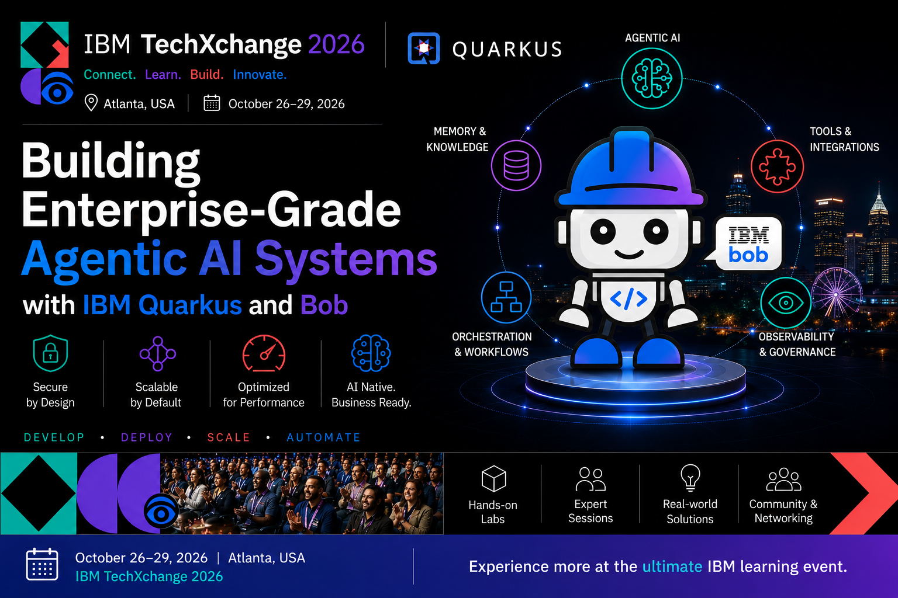

# LAB-1219 - Building Enterprise-Grade Agentic AI Systems with IBM Quarkus and Bob

**IBM TechXchange 2026 · Hands-On Lab · 90 minutes**

## Prerequisites

Confirm these before the lab starts:

| Requirement | Check |
|-------------|-------|
| **Java 25+** | `java -version` |
| Maven 3.9+ | or use `./mvnw` in each exercise |
| Quarkus **3.37.4** (IBM Enterprise Build) | Java 25 target |
| [IBM Bob](https://bob.ibm.com/){:target="_blank"} | Sign in before the lab starts |
| LLM API key | Provided in the room (`OPENAI_API_KEY`) |
| Free ports **8080**, **8888** | One process per exercise set |
| Docker or Podman | For Quarkus Dev Services (PostgreSQL, LGTM) |

## Get the code

```bash
git clone https://github.com/danieloh30/techxchange-2026-quarkus-bob-lab.git
cd techxchange-2026-quarkus-bob-lab
export OPENAI_API_KEY=sk-your-lab-key-here

# Your working project — start here for Exercise 1
cd lab
./mvnw quarkus:dev
```

Open [http://localhost:8080](http://localhost:8080){:target="_blank"} — Incident Dashboard with 8 seeded incidents and status cards.
No agent behavior yet: that's Exercise 1.


!!! tip "Reference solutions"
    Solutions live in `exercises/*/solution`. Each exercise guide links to its solution at the top — use them only if you get stuck.

## Exercises

| Exercise | Time | Focus |
|----------|------|-------|
| [1. Agent + tool](01-first-agent/START_HERE.md) | 15 min | `TriageAgent` + `TriageTool` |
| [2. Policy as prompt](02-maintenance-agent/START_HERE.md) | 10 min | `DiagnosticAgent` + `@SystemMessage` as policy |
| [3. Parallel agents](03-parallel-workflow/START_HERE.md) | 10 min | `@ParallelMapperAgent` + `@Output` |
| [4. Supervisor orchestration](04-supervisor/START_HERE.md) | 15 min | Full multi-agent supervisor |
| [5. AI governance](05-ibm-bob/START_HERE.md) | 10 min | `AGENTS.md` + IBM Bob |
| [6. Human gate + tracing](06-hitl-observability/START_HERE.md) | 10 min | Human-in-the-loop + OpenTelemetry |
| [7. Remote agents (A2A)](07-a2a/START_HERE.md) | 10 min | Distributed impact assessment agent |

Start with the **[Lab Overview](00-intro/SPEAKER_NOTES.md)** to understand the scenario, architecture, and learning path.

## Repository layout

| Path | Purpose |
|------|---------|
| `lab/` | Your hands-on Quarkus project (stub files with `// TODO`) |
| `AGENTS.md` | IBM Bob project context (token efficiency) |
| `docs/` | These lab instructions (this site) |
| `exercises/` | Completed Quarkus solution projects |

